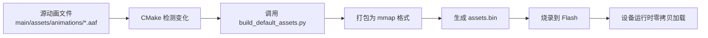

# AAF 动画一键打包指南

## 📦 概述

AAF 动画打包已集成到项目的构建系统中，支持**一键编译打包烧录**。

## 🎯 特性

- ✅ **零拷贝加载**：使用 `mmap_assets` 格式，动画直接从 Flash 读取，不占用 SRAM
- ✅ **自动打包**：编译时自动将动画打包到 `assets.bin`
- ✅ **自动烧录**：支持 `idf.py flash` 一键烧录
- ✅ **IDE 集成**：Cursor/VSCode 中点击编译即可

## 📁 目录结构

```
xiaozhi-esp32/
├── main/
│   └── assets/
│       └── animations/          # 动画源文件目录
│           ├── idle.aaf         # 待机动画
│           ├── listening.aaf    # 倾听动画
│           ├── speaking.aaf     # 说话动画
│           ├── loading.aaf      # 加载动画
│           ├── settings.aaf     # 设置动画
│           ├── updating.aaf     # 更新动画
│           ├── success.aaf      # 成功动画
│           └── error.aaf        # 错误动画
└── scripts/
    └── build_default_assets.py  # 打包脚本（已扩展）
```

## 🚀 使用方法

### 方式一：一键编译打包烧录（推荐）

```bash
cd /Users/xionghao/Documents/plaud/GitHub/xiaozhi-esp32

# 构建（自动打包动画）
idf.py build

# 烧录（自动烧录动画到 assets 分区）
idf.py -p /dev/ttyUSB0 flash
```

### 方式二：单独重新打包动画

如果只修改了动画文件，不想重新编译：

```bash
cd build
ninja generated_default_assets  # 只重新生成 assets.bin
```

## 📋 动画命名规范

动画文件名必须与设备状态对应：

| 文件名 | 状态 | 用途 |
|--------|------|------|
| `idle.aaf` | 待机 | 设备空闲时的动画 |
| `listening.aaf` | 倾听 | 接收语音输入时 |
| `speaking.aaf` | 说话 | 播放回复时 |
| `loading.aaf` | 加载 | 初始化/连接时 |
| `settings.aaf` | 设置 | 配置操作时 |
| `updating.aaf` | 更新 | 固件升级时 |
| `success.aaf` | 成功 | 操作成功反馈 |
| `error.aaf` | 错误 | 错误状态 |

## 🔧 高级配置

### 修改 FPS

编辑 `main/display/aaf_animation_config.h`：

```cpp
struct DeviceStateFps {
    static constexpr int IDLE = 15;       // 修改这里
    static constexpr int LISTENING = 30;
    // ...
};
```

### 添加更多动画

1. 将新的 `.aaf` 文件放到 `main/assets/animations/`
2. 在 `aaf_animation_config.h` 中添加映射
3. 重新编译即可

## 🛠️ 工作原理

### 构建流程



### mmap_assets 格式

```
assets.bin 结构：
┌─────────────────────────────┐
│ Header                      │
│  - file_count: 8            │
│  - checksum: 0x1234         │
│  - total_size: 1638400      │
├─────────────────────────────┤
│ File Table                  │
│  [0] idle.aaf:     58KB     │
│  [1] listening.aaf: 72KB    │
│  [2] speaking.aaf: 111KB    │
│  ...                        │
├─────────────────────────────┤
│ Animation Data              │
│  (原始 .aaf 数据)           │
│  零拷贝：直接从 Flash 读取  │
└─────────────────────────────┘
```

## 📊 内存占用对比

### 旧方案（SPIFFS + 文件读取）
- **SRAM 使用**：~1.6MB（所有动画加载到内存）
- **加载时间**：长（需要 I/O）
- **Flash 占用**：2.0MB（SPIFFS 开销）

### 新方案（mmap_assets）
- **SRAM 使用**：~2KB（只有元数据）
- **加载时间**：极快（零拷贝）
- **Flash 占用**：1.6MB（纯数据）

**节省 SRAM**：1.598MB ⚡

## 🐛 故障排查

### 问题：动画不显示

**检查列表**：
1. 确认动画文件在 `main/assets/animations/` 目录
2. 确认文件名正确（见命名规范）
3. 检查编译日志是否包含动画打包信息
4. 确认 assets 分区已烧录

查看日志：
```bash
idf.py monitor | grep -E "Animation|AafDisplay"
```

### 问题：编译时未打包动画

**可能原因**：CMake 缓存未更新

**解决**：
```bash
rm -rf build
idf.py reconfigure
idf.py build
```

### 问题：设备启动后加载失败

**查看运行日志**：
```
I (1233) AnimResManager: Initializing from partition: assets
I (1233) AnimResManager: Found 8 animation files
I (1240) AnimResManager: Animation[0]: idle, size=59392, fps=15
...
I (1270) AafDisplayWidget: ✅ Loaded 8 animations from mmap partition (zero-copy)
```

如果看到错误，检查 assets 分区是否正确烧录。

## 🎨 制作动画建议

### 推荐分辨率
- **240x240**: 适合小屏幕（主屏减去状态栏）
- **320x200**: Korvo-2-V3 板子（320x240 - 40px 状态栏）

### 推荐 FPS
- **待机/设置**: 15 FPS（流畅但省电）
- **倾听/加载**: 30 FPS（更灵动）
- **说话/错误**: 25 FPS（平衡）

### 文件大小控制
- 单个动画建议 < 500KB
- 总大小应 < 3.5MB（assets 分区为 4MB）

## 📚 相关文档

- [动画状态设计](../docs/xiaozhi-esp32/design/animation-states-design.md)
- [AAF Display 框架](main/display/README_AAF_DISPLAY.md)
- [动画配置文件](main/display/aaf_animation_config.h)

## ✨ 总结

使用新的一键打包流程，你只需要：

1. 将 `.aaf` 文件放到 `main/assets/animations/`
2. 运行 `idf.py build flash`
3. 完成！✅

**无需手动运行脚本，无需配置 SPIFFS，自动零拷贝优化！** 🚀

