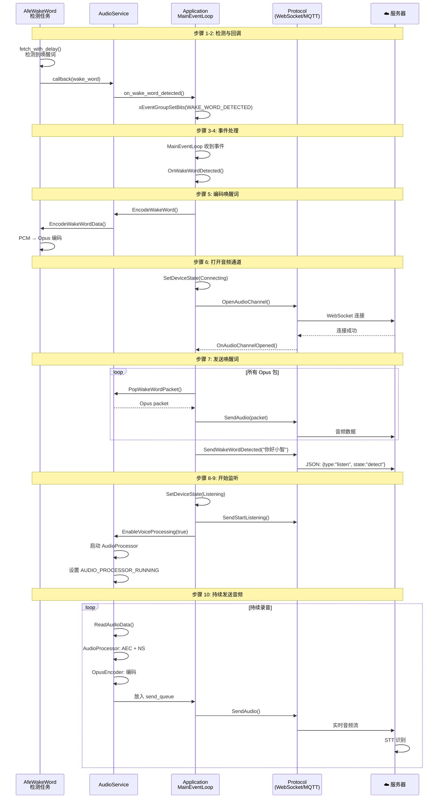

# 唤醒词检测后的执行流程详解

## 📋 概述

本文档详细分析从**检测到唤醒词**到**开始对话**的完整流程，包括每一步的代码执行路径、数据流动、状态变化。

---

## 🎯 完整执行链路

```
步骤 1: AFE 检测到唤醒词
     ↓
步骤 2: 触发回调链（三层回调）
     ↓
步骤 3: MainEventLoop 接收事件
     ↓
步骤 4: OnWakeWordDetected() 处理
     ↓
步骤 5: 编码唤醒词音频
     ↓
步骤 6: 打开音频通道（WebSocket/MQTT）
     ↓
步骤 7: 发送唤醒词数据
     ↓
步骤 8: 进入 Listening 状态
     ↓
步骤 9: 启用语音处理（录音）
     ↓
步骤 10: 持续发送音频到服务器
```

---

## 📍 步骤 1: AFE 检测到唤醒词

### 位置
```
文件: main/audio/wake_words/afe_wake_word.cc
函数: AudioDetectionTask()
行号: 198-209
```

### 详细代码

```cpp
void AfeWakeWord::AudioDetectionTask() {
    while (true) {
        // 等待检测启用
        xEventGroupWaitBits(event_group_, DETECTION_RUNNING_EVENT, ...);
        
        // ⭐ 从 AFE 获取处理结果（阻塞调用）
        auto res = afe_iface_->fetch_with_delay(afe_data_, portMAX_DELAY);
        
        if (res == nullptr || res->ret_value == ESP_FAIL) {
            continue;
        }
        
        // 存储唤醒词音频数据（用于后续发送给服务器）
        StoreWakeWordData(res->data, res->data_size / sizeof(int16_t));
        
        // ━━━━━━━━━━━━━━━━━━━━━━━━━━━━━━━━━━━━━━━━
        // ⭐⭐⭐ 关键判断：检查是否检测到唤醒词
        // ━━━━━━━━━━━━━━━━━━━━━━━━━━━━━━━━━━━━━━━━
        if (res->wakeup_state == WAKENET_DETECTED) {
            ESP_LOGI(TAG, "*** WAKE WORD DETECTED! *** model_index=%d", 
                     res->wakenet_model_index);
            
            // ① 停止检测（避免重复触发）
            Stop();  // 清除 DETECTION_RUNNING_EVENT
            
            // ② 获取唤醒词名称（例如："你好小智"）
            last_detected_wake_word_ = wake_words_[res->wakenet_model_index - 1];
            ESP_LOGI(TAG, "Wake word name: %s", last_detected_wake_word_.c_str());
            
            // ③ ⭐⭐⭐ 触发回调（进入步骤 2）
            if (wake_word_detected_callback_) {
                wake_word_detected_callback_(last_detected_wake_word_);
            } else {
                ESP_LOGW(TAG, "Wake word detected but callback is NULL!");
            }
        }
    }
}
```

### 关键数据结构

```cpp
// AFE 返回结果（ESP-SR 库提供）
typedef struct {
    esp_err_t ret_value;              // 操作结果
    int16_t* data;                    // 处理后的音频数据
    int data_size;                    // 数据大小（字节）
    afe_vad_state_t vad_state;        // VAD 状态
    afe_wakeup_state_t wakeup_state;  // ⭐ 唤醒状态
    int wakenet_model_index;          // 检测到的模型索引（1-based）
} afe_fetch_result_t;

// 唤醒状态枚举
typedef enum {
    WAKENET_NO_DETECT = 0,      // 未检测到
    WAKENET_CHANNEL_VERIFIED,   // 通道验证
    WAKENET_DETECTED,           // ⭐ 检测到唤醒词！
    WAKENET_CHANNEL_LOST        // 丢失通道
} afe_wakeup_state_t;
```

---

## 📍 步骤 2: 回调链传递（三层回调）

### 回调链路图

```
┌─────────────────────────────────────────────────────────────┐
│  层级 1: AfeWakeWord → AudioService                          │
├─────────────────────────────────────────────────────────────┤
│  文件: audio/wake_words/afe_wake_word.cc:204                │
│  wake_word_detected_callback_(last_detected_wake_word_);    │
│                                                             │
│  这个回调在哪里设置的？                                       │
│  → audio/audio_service.cc:698-702                          │
└─────────────────────────────────────────────────────────────┘
         ↓
┌─────────────────────────────────────────────────────────────┐
│  层级 2: AudioService → Application                          │
├─────────────────────────────────────────────────────────────┤
│  文件: audio/audio_service.cc:698-702                       │
│                                                             │
│  wake_word_->OnWakeWordDetected([this](const string& ww) { │
│      if (callbacks_.on_wake_word_detected) {               │
│          callbacks_.on_wake_word_detected(ww);  ⭐         │
│      }                                                     │
│  });                                                       │
│                                                             │
│  这个回调在哪里设置的？                                       │
│  → application.cc:378-380                                  │
└─────────────────────────────────────────────────────────────┘
         ↓
┌─────────────────────────────────────────────────────────────┐
│  层级 3: Application Lambda → 设置事件位                      │
├─────────────────────────────────────────────────────────────┤
│  文件: application.cc:378-380                               │
│                                                             │
│  callbacks.on_wake_word_detected = [this](const string& ww) {│
│      // ⭐ 设置事件位，通知 MainEventLoop                    │
│      xEventGroupSetBits(event_group_,                       │
│                         MAIN_EVENT_WAKE_WORD_DETECTED);     │
│  };                                                         │
│                                                             │
│  MainEventLoop 会等待这个事件位 → 进入步骤 3                  │
└─────────────────────────────────────────────────────────────┘
```

### 回调设置的时机

#### A. AudioService 设置 AfeWakeWord 的回调

```cpp
// 文件: main/audio/audio_service.cc
// 函数: SetModelsList()
// 位置: 662-703 行
// 时机: 应用启动时加载模型后

void AudioService::SetModelsList(srmodel_list_t* models_list) {
    models_list_ = models_list;
    
    // ... 根据模型类型创建 wake_word_ 对象 ...
    
    if (wake_word_) {
        ESP_LOGI(TAG, "Wake word object created successfully");
        
        // ⭐ 设置回调：当 AfeWakeWord 检测到唤醒词时调用
        wake_word_->OnWakeWordDetected([this](const std::string& wake_word) {
            // 传递给 Application 层
            if (callbacks_.on_wake_word_detected) {
                callbacks_.on_wake_word_detected(wake_word);
            }
        });
    }
}
```

#### B. Application 设置 AudioService 的回调

```cpp
// 文件: main/application.cc
// 函数: Start()
// 位置: 374-384 行
// 时机: 应用启动时

void Application::Start() {
    // ... 初始化音频服务 ...
    
    AudioServiceCallbacks callbacks;
    
    // ⭐ 设置唤醒词检测回调
    callbacks.on_wake_word_detected = [this](const std::string& wake_word) {
        // 设置事件位，通知主事件循环
        xEventGroupSetBits(event_group_, MAIN_EVENT_WAKE_WORD_DETECTED);
    };
    
    // 其他回调
    callbacks.on_vad_change = [this](bool speaking) {
        xEventGroupSetBits(event_group_, MAIN_EVENT_VAD_CHANGE);
    };
    
    callbacks.on_send_queue_available = [this]() {
        xEventGroupSetBits(event_group_, MAIN_EVENT_SEND_AUDIO);
    };
    
    audio_service_.SetCallbacks(callbacks);
    
    // ... 启动主事件循环任务 ...
}
```

---

## 📍 步骤 3: MainEventLoop 接收事件

### 位置
```
文件: main/application.cc
函数: MainEventLoop()
行号: 569-624
```

### 详细代码

```cpp
void Application::MainEventLoop() {
    while (true) {
        // ━━━━━━━━━━━━━━━━━━━━━━━━━━━━━━━━━━━━━━━━
        // 等待多个事件（阻塞）
        // ━━━━━━━━━━━━━━━━━━━━━━━━━━━━━━━━━━━━━━━━
        auto bits = xEventGroupWaitBits(
            event_group_,
            MAIN_EVENT_SCHEDULE |
            MAIN_EVENT_SEND_AUDIO |
            MAIN_EVENT_WAKE_WORD_DETECTED |  // ⭐ 唤醒词事件
            MAIN_EVENT_VAD_CHANGE |
            MAIN_EVENT_CLOCK_TICK |
            MAIN_EVENT_ERROR,
            pdTRUE,   // 清除事件位
            pdFALSE,  // 任一事件即可
            portMAX_DELAY  // 永久等待
        );
        
        // ━━━━━━━━━━━━━━━━━━━━━━━━━━━━━━━━━━━━━━━━
        // 处理错误事件
        // ━━━━━━━━━━━━━━━━━━━━━━━━━━━━━━━━━━━━━━━━
        if (bits & MAIN_EVENT_ERROR) {
            SetDeviceState(kDeviceStateIdle);
            Alert(Lang::Strings::ERROR, last_error_message_.c_str(), 
                  "circle_xmark", Lang::Sounds::OGG_EXCLAMATION);
        }
        
        // ━━━━━━━━━━━━━━━━━━━━━━━━━━━━━━━━━━━━━━━━
        // 处理音频发送事件
        // ━━━━━━━━━━━━━━━━━━━━━━━━━━━━━━━━━━━━━━━━
        if (bits & MAIN_EVENT_SEND_AUDIO) {
            while (auto packet = audio_service_.PopPacketFromSendQueue()) {
                if (protocol_ && !protocol_->SendAudio(std::move(packet))) {
                    break;
                }
            }
        }
        
        // ━━━━━━━━━━━━━━━━━━━━━━━━━━━━━━━━━━━━━━━━
        // ⭐⭐⭐ 处理唤醒词检测事件（进入步骤 4）
        // ━━━━━━━━━━━━━━━━━━━━━━━━━━━━━━━━━━━━━━━━
        if (bits & MAIN_EVENT_WAKE_WORD_DETECTED) {
            OnWakeWordDetected();  // ⭐ 核心处理函数
        }
        
        // ━━━━━━━━━━━━━━━━━━━━━━━━━━━━━━━━━━━━━━━━
        // 处理 VAD 变化事件
        // ━━━━━━━━━━━━━━━━━━━━━━━━━━━━━━━━━━━━━━━━
        if (bits & MAIN_EVENT_VAD_CHANGE) {
            if (device_state_ == kDeviceStateListening) {
                auto led = Board::GetInstance().GetLed();
                led->OnStateChanged();  // 更新 LED 状态
            }
        }
        
        // ━━━━━━━━━━━━━━━━━━━━━━━━━━━━━━━━━━━━━━━━
        // 处理调度任务
        // ━━━━━━━━━━━━━━━━━━━━━━━━━━━━━━━━━━━━━━━━
        if (bits & MAIN_EVENT_SCHEDULE) {
            std::unique_lock<std::mutex> lock(mutex_);
            auto tasks = std::move(main_tasks_);
            lock.unlock();
            for (auto& task : tasks) {
                task();  // 执行异步任务
            }
        }
        
        // ━━━━━━━━━━━━━━━━━━━━━━━━━━━━━━━━━━━━━━━━
        // 处理时钟周期（每秒）
        // ━━━━━━━━━━━━━━━━━━━━━━━━━━━━━━━━━━━━━━━━
        if (bits & MAIN_EVENT_CLOCK_TICK) {
            clock_ticks_++;
            auto display = Board::GetInstance().GetDisplay();
            display->UpdateStatusBar();  // 更新状态栏
            
            // 每 10 秒打印内存信息
            if (clock_ticks_ % 10 == 0) {
                SystemInfo::PrintHeapStats();
            }
        }
    }
}
```

### 事件位定义

```cpp
// 文件: main/application.h
#define MAIN_EVENT_SCHEDULE             (1 << 0)  // 0x01
#define MAIN_EVENT_SEND_AUDIO           (1 << 1)  // 0x02
#define MAIN_EVENT_WAKE_WORD_DETECTED   (1 << 2)  // 0x04 ⭐
#define MAIN_EVENT_VAD_CHANGE           (1 << 3)  // 0x08
#define MAIN_EVENT_CLOCK_TICK           (1 << 4)  // 0x10
#define MAIN_EVENT_ERROR                (1 << 5)  // 0x20
```

---

## 📍 步骤 4: OnWakeWordDetected() 核心处理

### 位置
```
文件: main/application.cc
函数: OnWakeWordDetected()
行号: 626-669
```

### 完整流程图

```
OnWakeWordDetected()
    ↓
检查 protocol_ 是否初始化？
    ├─ 否 → 返回（忽略唤醒）
    └─ 是 → 继续
    ↓
检查当前设备状态？
    ├─ kDeviceStateIdle      → 处理唤醒（正常流程）⭐
    ├─ kDeviceStateSpeaking  → 打断播放
    └─ 其他状态               → 忽略
    ↓
【正常唤醒流程】
    ↓
① 编码唤醒词音频（步骤 5）
    ↓
② 检查音频通道是否已打开？
    ├─ 否 → 打开音频通道（步骤 6）
    │       ├─ 成功 → 继续
    │       └─ 失败 → 重新启用唤醒检测，返回
    └─ 是 → 跳过（通道已打开）
    ↓
③ 获取唤醒词名称（步骤 7）
    ↓
④ 发送唤醒词数据到服务器
    ├─ 发送唤醒词音频包
    └─ 发送唤醒词名称
    ↓
⑤ 设置监听模式
    ├─ 无 AEC → kListeningModeAutoStop（手动停止）
    └─ 有 AEC → kListeningModeRealtime（实时模式）
    ↓
⑥ 音频通道打开成功后的回调会触发
   → 进入 Listening 状态（步骤 8）
```

### 详细代码

```cpp
void Application::OnWakeWordDetected() {
    ESP_LOGI(TAG, "OnWakeWordDetected() called, device_state=%d, protocol=%p", 
             device_state_, protocol_.get());
    
    // ━━━━━━━━━━━━━━━━━━━━━━━━━━━━━━━━━━━━━━━━
    // 前置检查：协议是否初始化
    // ━━━━━━━━━━━━━━━━━━━━━━━━━━━━━━━━━━━━━━━━
    if (!protocol_) {
        ESP_LOGW(TAG, "Protocol not initialized, ignoring wake word");
        return;
    }
    
    // ━━━━━━━━━━━━━━━━━━━━━━━━━━━━━━━━━━━━━━━━
    // 根据当前状态处理
    // ━━━━━━━━━━━━━━━━━━━━━━━━━━━━━━━━━━━━━━━━
    if (device_state_ == kDeviceStateIdle) {
        // ════════════════════════════════════════════
        // 正常唤醒流程（设备在待机状态）
        // ════════════════════════════════════════════
        
        ESP_LOGI(TAG, "Device in IDLE state, processing wake word...");
        
        // ──────────────────────────────────────────
        // ① 编码唤醒词音频（步骤 5）
        // ──────────────────────────────────────────
        audio_service_.EncodeWakeWord();
        // 将存储的唤醒词音频（1-2秒）编码为 Opus 格式
        
        // ──────────────────────────────────────────
        // ② 检查并打开音频通道（步骤 6）
        // ──────────────────────────────────────────
        if (!protocol_->IsAudioChannelOpened()) {
            ESP_LOGI(TAG, "Opening audio channel...");
            SetDeviceState(kDeviceStateConnecting);  // 显示"连接中"
            
            // ⭐ 打开音频通道（WebSocket 或 MQTT）
            if (!protocol_->OpenAudioChannel()) {
                // 连接失败
                ESP_LOGE(TAG, "Failed to open audio channel, re-enabling wake word detection");
                audio_service_.EnableWakeWordDetection(true);  // 重新启用检测
                return;
            }
            // 成功后会触发 OnAudioChannelOpened 回调
        }
        
        // ──────────────────────────────────────────
        // ③ 获取唤醒词名称
        // ──────────────────────────────────────────
        auto wake_word = audio_service_.GetLastWakeWord();
        ESP_LOGI(TAG, "*** Wake word detected: %s ***", wake_word.c_str());
        
#if CONFIG_SEND_WAKE_WORD_DATA
        // ──────────────────────────────────────────
        // ④ 发送唤醒词数据到服务器
        // ──────────────────────────────────────────
        
        // A. 发送唤醒词音频包（Opus 编码后的音频）
        while (auto packet = audio_service_.PopWakeWordPacket()) {
            protocol_->SendAudio(std::move(packet));
        }
        
        // B. 发送唤醒词名称（JSON 消息）
        protocol_->SendWakeWordDetected(wake_word);
        // 内部发送: {"type":"listen", "state":"detect", "text":"你好小智"}
        
        // ──────────────────────────────────────────
        // ⑤ 设置监听模式
        // ──────────────────────────────────────────
        if (aec_mode_ == kAecOff) {
            // 无 AEC: 手动停止模式（说完后需要手动停止）
            SetListeningMode(kListeningModeAutoStop);
        } else {
            // 有 AEC: 实时模式（可以打断）
            SetListeningMode(kListeningModeRealtime);
        }
#else
        // 如果不发送唤醒词数据，播放提示音
        SetListeningMode(aec_mode_ == kAecOff ? kListeningModeAutoStop : kListeningModeRealtime);
        audio_service_.PlaySound(Lang::Sounds::OGG_POPUP);
#endif
        
    } else if (device_state_ == kDeviceStateSpeaking) {
        // ════════════════════════════════════════════
        // 在播放时检测到唤醒词 → 打断播放
        // ════════════════════════════════════════════
        AbortSpeaking(kAbortReasonWakeWordDetected);
        
    } else if (device_state_ == kDeviceStateActivating) {
        // ════════════════════════════════════════════
        // 在激活状态检测到唤醒词 → 返回待机
        // ════════════════════════════════════════════
        SetDeviceState(kDeviceStateIdle);
    }
}
```

---

## 📍 步骤 5: 编码唤醒词音频

### 位置
```
文件: main/audio/audio_service.cc
函数: EncodeWakeWord()
行号: 441-445

调用链:
  AudioService::EncodeWakeWord()
  → AfeWakeWord::EncodeWakeWordData()
  → 创建编码任务，将 PCM 编码为 Opus
```

### 详细代码

#### A. AudioService 层

```cpp
// 文件: main/audio/audio_service.cc: 441-445
void AudioService::EncodeWakeWord() {
    if (wake_word_) {
        wake_word_->EncodeWakeWordData();
    }
}
```

#### B. AfeWakeWord 层

```cpp
// 文件: main/audio/wake_words/afe_wake_word.cc: 222-257
void AfeWakeWord::EncodeWakeWordData() {
    const size_t stack_size = 4096 * 7;  // 28KB 栈空间
    wake_word_opus_.clear();  // 清空之前的编码数据
    
    // ① 分配任务栈（PSRAM）
    if (wake_word_encode_task_stack_ == nullptr) {
        wake_word_encode_task_stack_ = (StackType_t*)heap_caps_malloc(
            stack_size, MALLOC_CAP_SPIRAM);
        assert(wake_word_encode_task_stack_ != nullptr);
    }
    
    // ② 分配任务控制块（内部 RAM）
    if (wake_word_encode_task_buffer_ == nullptr) {
        wake_word_encode_task_buffer_ = (StaticTask_t*)heap_caps_malloc(
            sizeof(StaticTask_t), MALLOC_CAP_INTERNAL);
        assert(wake_word_encode_task_buffer_ != nullptr);
    }
    
    // ③ 创建静态任务进行编码（避免动态分配）
    auto task_handle = xTaskCreateStatic([](void* arg) {
        auto this_ = (AfeWakeWord*)arg;
        
        // 创建 Opus 编码器（16kHz, 1 通道, 60ms 帧）
        OpusEncoderWrapper encoder(16000, 1, 60);
        
        // 逐帧编码 PCM 数据
        for (auto& pcm : this_->wake_word_pcm_) {
            std::vector<uint8_t> opus;
            if (encoder.Encode(std::move(pcm), opus)) {
                // 编码成功，存储 Opus 数据
                this_->wake_word_opus_.push_back(std::move(opus));
            }
        }
        
        vTaskDelete(NULL);  // 任务完成，自我删除
    }, 
    "encode_wake_word",              // 任务名
    stack_size,                      // 栈大小
    this,                            // 参数
    3,                               // 优先级
    wake_word_encode_task_stack_,   // 栈指针
    wake_word_encode_task_buffer_);  // 任务控制块
}
```

### 唤醒词音频存储

```cpp
// 唤醒词音频在检测时就已经存储了
// 文件: main/audio/wake_words/afe_wake_word.cc: 213-220
void AfeWakeWord::StoreWakeWordData(const int16_t* data, size_t samples) {
    // 存储原始 PCM 数据（用于后续编码）
    wake_word_pcm_.push_back(std::vector<int16_t>(data, data + samples));
    
    // 保持最近 2 秒的数据（16kHz * 2秒 / 512 = 约 62 帧）
    while (wake_word_pcm_.size() > 62) {
        wake_word_pcm_.pop_front();  // 删除最旧的帧
    }
}
```

---

## 📍 步骤 6: 打开音频通道

### 位置
```
文件: main/application.cc:642
调用: protocol_->OpenAudioChannel()

实现:
  - WebSocket: main/protocols/websocket_protocol.cc:82-254
  - MQTT: main/protocols/mqtt_protocol.cc:198-260
```

### WebSocket 实现详解

```cpp
// 文件: main/protocols/websocket_protocol.cc: 82-254
bool WebsocketProtocol::OpenAudioChannel() {
    // ━━━━━━━━━━━━━━━━━━━━━━━━━━━━━━━━━━━━━━━━
    // ① 读取配置
    // ━━━━━━━━━━━━━━━━━━━━━━━━━━━━━━━━━━━━━━━━
    Settings settings("websocket", false);
    std::string url = settings.GetString("url");
    std::string token = settings.GetString("token");
    int version = settings.GetInt("version");
    if (version != 0) {
        version_ = version;
    }
    
    error_occurred_ = false;
    
    // ━━━━━━━━━━━━━━━━━━━━━━━━━━━━━━━━━━━━━━━━
    // ② 创建 WebSocket 实例
    // ━━━━━━━━━━━━━━━━━━━━━━━━━━━━━━━━━━━━━━━━
    auto network = Board::GetInstance().GetNetwork();
    websocket_ = network->CreateWebSocket(1);  // priority=1
    if (websocket_ == nullptr) {
        ESP_LOGE(TAG, "Failed to create websocket");
        return false;
    }
    
    // ━━━━━━━━━━━━━━━━━━━━━━━━━━━━━━━━━━━━━━━━
    // ③ 设置 HTTP 头
    // ━━━━━━━━━━━━━━━━━━━━━━━━━━━━━━━━━━━━━━━━
    if (!token.empty()) {
        if (token.find(" ") == std::string::npos) {
            token = "Bearer " + token;
        }
        websocket_->SetHeader("Authorization", token.c_str());
    }
    websocket_->SetHeader("Protocol-Version", std::to_string(version_).c_str());
    websocket_->SetHeader("Device-Id", SystemInfo::GetMacAddress().c_str());
    websocket_->SetHeader("Client-Id", Board::GetInstance().GetUuid().c_str());
    
    // ━━━━━━━━━━━━━━━━━━━━━━━━━━━━━━━━━━━━━━━━
    // ④ 设置数据接收回调
    // ━━━━━━━━━━━━━━━━━━━━━━━━━━━━━━━━━━━━━━━━
    websocket_->OnData([this](const char* data, size_t len, bool binary) {
        if (binary) {
            // 接收二进制数据（音频）
            if (on_incoming_audio_ != nullptr) {
                // 解析二进制协议头，提取音频 payload
                // ...
                on_incoming_audio_(std::make_unique<AudioStreamPacket>(...));
            }
        } else {
            // 接收文本数据（JSON）
            auto root = cJSON_Parse(data);
            auto type = cJSON_GetObjectItem(root, "type");
            
            if (strcmp(type->valuestring, "hello") == 0) {
                // 服务器 hello 消息
                ParseServerHello(root);
            } else {
                // 其他 JSON 消息（stt, tts, llm, mcp 等）
                if (on_incoming_json_ != nullptr) {
                    on_incoming_json_(root);
                }
            }
            cJSON_Delete(root);
        }
    });
    
    // ━━━━━━━━━━━━━━━━━━━━━━━━━━━━━━━━━━━━━━━━
    // ⑤ 设置连接回调
    // ━━━━━━━━━━━━━━━━━━━━━━━━━━━━━━━━━━━━━━━━
    websocket_->OnConnected([this]() {
        ESP_LOGI(TAG, "WebSocket connected");
        xEventGroupSetBits(event_group_handle_, WEBSOCKET_CONNECTED);
        
        // ⭐ 触发音频通道打开回调
        if (on_audio_channel_opened_) {
            on_audio_channel_opened_();
        }
    });
    
    // ━━━━━━━━━━━━━━━━━━━━━━━━━━━━━━━━━━━━━━━━
    // ⑥ 设置断开回调
    // ━━━━━━━━━━━━━━━━━━━━━━━━━━━━━━━━━━━━━━━━
    websocket_->OnDisconnected([this]() {
        ESP_LOGI(TAG, "WebSocket disconnected");
        xEventGroupClearBits(event_group_handle_, WEBSOCKET_CONNECTED);
        
        if (!error_occurred_) {
            // ⭐ 触发音频通道关闭回调
            if (on_audio_channel_closed_) {
                on_audio_channel_closed_();
            }
        }
    });
    
    // ━━━━━━━━━━━━━━━━━━━━━━━━━━━━━━━━━━━━━━━━
    // ⑦ 连接 WebSocket
    // ━━━━━━━━━━━━━━━━━━━━━━━━━━━━━━━━━━━━━━━━
    if (!websocket_->Connect(url.c_str())) {
        ESP_LOGE(TAG, "Failed to connect to websocket");
        websocket_ = nullptr;
        return false;
    }
    
    // ━━━━━━━━━━━━━━━━━━━━━━━━━━━━━━━━━━━━━━━━
    // ⑧ 等待连接成功（最多 10 秒）
    // ━━━━━━━━━━━━━━━━━━━━━━━━━━━━━━━━━━━━━━━━
    auto bits = xEventGroupWaitBits(
        event_group_handle_,
        WEBSOCKET_CONNECTED | WEBSOCKET_ERROR,
        pdFALSE,
        pdFALSE,
        pdMS_TO_TICKS(10000)
    );
    
    if (bits & WEBSOCKET_ERROR) {
        ESP_LOGE(TAG, "WebSocket connection error");
        return false;
    }
    
    if ((bits & WEBSOCKET_CONNECTED) == 0) {
        ESP_LOGE(TAG, "WebSocket connection timeout");
        return false;
    }
    
    ESP_LOGI(TAG, "Audio channel opened successfully");
    return true;
}
```

### 音频通道打开成功的回调

```cpp
// 文件: main/application.cc: 438-444
// 在 Start() 函数中设置

protocol_->OnAudioChannelOpened([this, codec, &board]() {
    // ① 禁用省电模式（保持 CPU 全速）
    board.SetPowerSaveMode(false);
    
    // ② 检查采样率匹配
    if (protocol_->server_sample_rate() != codec->output_sample_rate()) {
        ESP_LOGW(TAG, "Server sample rate %d does not match device output sample rate %d",
                protocol_->server_sample_rate(), codec->output_sample_rate());
    }
    
    // ③ 进入 Listening 状态（在 OnWakeWordDetected 的后续流程中）
});
```

---

## 📍 步骤 7: 发送唤醒词数据

### A. 发送唤醒词音频包

```cpp
// 文件: main/application.cc: 653-655
while (auto packet = audio_service_.PopWakeWordPacket()) {
    protocol_->SendAudio(std::move(packet));
}
```

#### PopWakeWordPacket 实现

```cpp
// 文件: main/audio/audio_service.cc: 451-457
std::unique_ptr<AudioStreamPacket> AudioService::PopWakeWordPacket() {
    auto packet = std::make_unique<AudioStreamPacket>();
    
    // 从 wake_word_ 获取编码后的 Opus 数据
    if (wake_word_->GetWakeWordOpus(packet->payload)) {
        return packet;  // 返回一个音频包
    }
    
    return nullptr;  // 没有更多数据
}
```

#### GetWakeWordOpus 实现

```cpp
// 文件: main/audio/wake_words/afe_wake_word.cc: 258-265
bool AfeWakeWord::GetWakeWordOpus(std::vector<uint8_t>& opus) {
    if (wake_word_opus_.empty()) {
        return false;  // 没有数据
    }
    
    // 取出第一个 Opus 包
    opus = std::move(wake_word_opus_.front());
    wake_word_opus_.pop_front();
    
    return true;
}
```

### B. 发送唤醒词名称

```cpp
// 文件: main/application.cc: 657
protocol_->SendWakeWordDetected(wake_word);
```

#### SendWakeWordDetected 实现

```cpp
// 文件: main/protocols/protocol.cc: 51-55
void Protocol::SendWakeWordDetected(const std::string& wake_word) {
    // 构造 JSON 消息
    std::string json = "{\"session_id\":\"" + session_id_ + 
                      "\",\"type\":\"listen\",\"state\":\"detect\",\"text\":\"" + 
                      wake_word + "\"}";
    
    // 发送 JSON 文本
    SendText(json);
}
```

**JSON 消息示例:**
```json
{
    "session_id": "abc123",
    "type": "listen",
    "state": "detect",
    "text": "你好小智"
}
```

---

## 📍 步骤 8: 进入 Listening 状态

### 位置
```
文件: main/application.cc
函数: SetDeviceState()
行号: 716-727
```

### 触发时机

音频通道打开成功后，在 `OnWakeWordDetected()` 的后续流程中（或通过回调）会调用：
```cpp
SetDeviceState(kDeviceStateListening);
```

### 详细代码

```cpp
case kDeviceStateListening:
    // ━━━━━━━━━━━━━━━━━━━━━━━━━━━━━━━━━━━━━━━━
    // ① 更新显示
    // ━━━━━━━━━━━━━━━━━━━━━━━━━━━━━━━━━━━━━━━━
    display->SetStatus(Lang::Strings::LISTENING);  // "聆听中"
    display->SetEmotion("neutral");
    
    // ━━━━━━━━━━━━━━━━━━━━━━━━━━━━━━━━━━━━━━━━
    // ② 确保音频处理器正在运行
    // ━━━━━━━━━━━━━━━━━━━━━━━━━━━━━━━━━━━━━━━━
    if (!audio_service_.IsAudioProcessorRunning()) {
        // A. 发送开始监听命令给服务器
        protocol_->SendStartListening(listening_mode_);
        // JSON: {"type":"listen", "state":"start", "mode":"realtime"}
        
        // B. ⭐ 启用语音处理（开始录音并编码）
        audio_service_.EnableVoiceProcessing(true);
        // → 启动 AudioProcessor
        // → 开始读取音频
        // → 编码为 Opus
        // → 发送到服务器
        
        // C. 禁用唤醒词检测（对话期间不检测）
        audio_service_.EnableWakeWordDetection(false);
    }
    break;
```

---

## 📍 步骤 9: 启用语音处理（开始录音）

### 位置
```
文件: main/audio/audio_service.cc
函数: EnableVoiceProcessing()
行号: 487-503
```

### 详细代码

```cpp
void AudioService::EnableVoiceProcessing(bool enable) {
    ESP_LOGD(TAG, "%s voice processing", enable ? "Enabling" : "Disabling");
    
    if (enable) {
        // ━━━━━━━━━━━━━━━━━━━━━━━━━━━━━━━━━━━━━━━━
        // ① 首次调用：初始化音频处理器
        // ━━━━━━━━━━━━━━━━━━━━━━━━━━━━━━━━━━━━━━━━
        if (!audio_processor_initialized_) {
            audio_processor_->Initialize(codec_, OPUS_FRAME_DURATION_MS, models_list_);
            audio_processor_initialized_ = true;
        }
        
        // ━━━━━━━━━━━━━━━━━━━━━━━━━━━━━━━━━━━━━━━━
        // ② 确保没有音频在播放
        // ━━━━━━━━━━━━━━━━━━━━━━━━━━━━━━━━━━━━━━━━
        ResetDecoder();
        
        // ━━━━━━━━━━━━━━━━━━━━━━━━━━━━━━━━━━━━━━━━
        // ③ 标记需要预热（跳过前几帧）
        // ━━━━━━━━━━━━━━━━━━━━━━━━━━━━━━━━━━━━━━━━
        audio_input_need_warmup_ = true;
        
        // ━━━━━━━━━━━━━━━━━━━━━━━━━━━━━━━━━━━━━━━━
        // ④ 启动音频处理器
        // ━━━━━━━━━━━━━━━━━━━━━━━━━━━━━━━━━━━━━━━━
        audio_processor_->Start();
        
        // ━━━━━━━━━━━━━━━━━━━━━━━━━━━━━━━━━━━━━━━━
        // ⑤ 设置事件位（通知 AudioInputTask）
        // ━━━━━━━━━━━━━━━━━━━━━━━━━━━━━━━━━━━━━━━━
        xEventGroupSetBits(event_group_, AS_EVENT_AUDIO_PROCESSOR_RUNNING);
        
    } else {
        // 停止语音处理
        audio_processor_->Stop();
        xEventGroupClearBits(event_group_, AS_EVENT_AUDIO_PROCESSOR_RUNNING);
    }
}
```

---

## 📍 步骤 10: 持续发送音频到服务器

### AudioInputTask 切换到语音处理

```cpp
// 文件: main/audio/audio_service.cc: 244-254
void AudioService::AudioInputTask() {
    while (true) {
        // 等待事件
        EventBits_t bits = xEventGroupWaitBits(
            event_group_,
            AS_EVENT_WAKE_WORD_RUNNING |      // 唤醒词检测
            AS_EVENT_AUDIO_PROCESSOR_RUNNING, // ⭐ 语音处理
            pdFALSE, pdFALSE, portMAX_DELAY
        );
        
        // ... 唤醒词检测分支 ...
        
        // ━━━━━━━━━━━━━━━━━━━━━━━━━━━━━━━━━━━━━━━━
        // ⭐ 语音处理分支（对话模式）
        // ━━━━━━━━━━━━━━━━━━━━━━━━━━━━━━━━━━━━━━━━
        if (bits & AS_EVENT_AUDIO_PROCESSOR_RUNNING) {
            std::vector<int16_t> data;
            int samples = audio_processor_->GetFeedSize();
            
            if (samples > 0) {
                // ① 读取音频数据
                if (ReadAudioData(data, 16000, samples)) {
                    // ② 送入音频处理器
                    audio_processor_->Feed(std::move(data));
                    // → 内部会进行 AEC、NS 处理
                    // → 编码为 Opus
                    // → 放入发送队列
                    continue;
                }
            }
        }
    }
}
```

### 音频发送流程

```
AudioInputTask
    ↓ ReadAudioData()
音频数据 (16kHz PCM)
    ↓ audio_processor_->Feed()
AudioProcessor
    ├─ AEC（回声消除）
    ├─ NS（降噪）
    └─ VAD（活动检测）
    ↓ OnOutput callback
OpusEncoder
    ↓ Encode()
Opus 数据包
    ↓ PushTaskToEncodeQueue()
audio_send_queue_
    ↓ MainEventLoop (MAIN_EVENT_SEND_AUDIO)
protocol_->SendAudio()
    ↓
WebSocket/MQTT 发送
    ↓
☁️ 服务器接收
```

---

## 🔄 完整时序图



---

## 📊 关键数据流

### 1. 唤醒词音频数据流

```
检测阶段（持续存储）:
  AFE → StoreWakeWordData() → wake_word_pcm_ (deque<vector<int16_t>>)
  存储: 最近 2 秒的原始 PCM 数据

编码阶段:
  wake_word_pcm_ → OpusEncoder → wake_word_opus_ (deque<vector<uint8_t>>)
  编码: 所有 PCM 帧编码为 Opus 包

发送阶段:
  wake_word_opus_ → PopWakeWordPacket() → AudioStreamPacket → SendAudio()
  发送: 逐包发送到服务器
```

### 2. 实时语音数据流

```
录音:
  I2S DMA → ReadAudioData() → PCM (16kHz, 单声道)
  
处理:
  PCM → AudioProcessor → AEC + NS + VAD → 处理后的 PCM
  
编码:
  处理后的 PCM → OpusEncoder → Opus 包
  
发送:
  Opus 包 → audio_send_queue_ → SendAudio() → 服务器
```

---

## 🎓 总结

### 关键步骤回顾

| 步骤 | 函数/位置 | 主要操作 | 耗时 |
|-----|----------|---------|------|
| **1** | `AudioDetectionTask:198` | AFE 检测到唤醒词 | ~200ms |
| **2** | 回调链传递 | 三层回调传递事件 | <1ms |
| **3** | `MainEventLoop:591` | 接收唤醒事件 | <1ms |
| **4** | `OnWakeWordDetected:626` | 处理唤醒 | ~10ms |
| **5** | `EncodeWakeWord:441` | 编码唤醒词音频 | ~100ms |
| **6** | `OpenAudioChannel:642` | 打开 WebSocket | ~500ms |
| **7** | `SendAudio:654` | 发送唤醒词数据 | ~50ms |
| **8** | `SetDeviceState:716` | 进入 Listening 状态 | <1ms |
| **9** | `EnableVoiceProcessing:487` | 启用语音处理 | ~10ms |
| **10** | `AudioInputTask:244` | 持续发送音频 | 持续 |

**总延迟**: 约 **870ms**（从检测到开始录音）

### 关键代码位置速查

| 功能 | 文件:行号 |
|-----|----------|
| **检测到唤醒** | `afe_wake_word.cc:198` |
| **回调设置** | `application.cc:378` |
| **事件处理** | `application.cc:591` |
| **核心处理** | `application.cc:626` |
| **编码音频** | `audio_service.cc:441` |
| **打开通道** | `application.cc:642` |
| **发送数据** | `application.cc:653-657` |
| **进入监听** | `application.cc:716` |
| **启用录音** | `audio_service.cc:487` |

---

**文档版本:** v1.0  
**创建日期:** 2025-10-10  
**适用场景:** ESP32-S3 + AfeWakeWord + WebSocket

