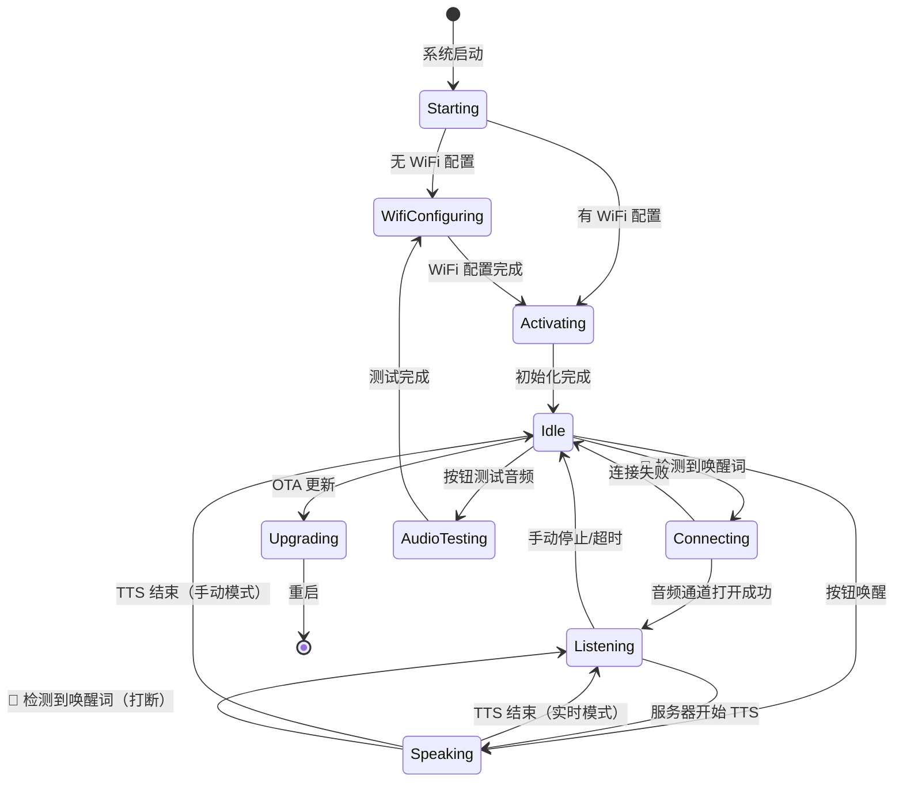
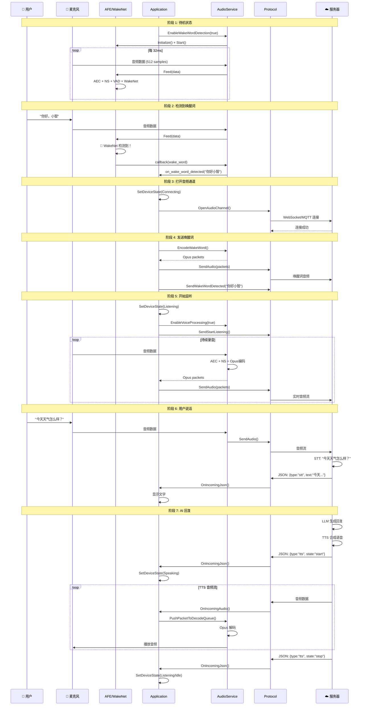

# 小智 ESP32 唤醒流程完整分析

## 📋 目录
1. [系统启动流程](#系统启动流程)
2. [初始化阶段](#初始化阶段)
3. [待机状态](#待机状态)
4. [唤醒检测流程](#唤醒检测流程)
5. [状态转换](#状态转换)
6. [对话流程](#对话流程)
7. [时序图](#时序图)
8. [关键代码位置](#关键代码位置)

---

## 🚀 系统启动流程

### 阶段 1: 硬件初始化 (main.cc)

```cpp
文件: main/main.cc
函数: app_main()
位置: 第 15-32 行

流程:
1. 创建默认事件循环
2. 初始化 NVS Flash（存储 WiFi 配置）
3. 启动 Application 单例
```

**详细代码:**
```cpp
extern "C" void app_main(void) {
    // 1. 创建 ESP-IDF 事件循环（用于 WiFi、网络事件）
    ESP_ERROR_CHECK(esp_event_loop_create_default());
    
    // 2. 初始化 NVS（Non-Volatile Storage）
    //    用于存储：WiFi 配置、用户设置、assets 版本等
    esp_err_t ret = nvs_flash_init();
    if (ret == ESP_ERR_NVS_NO_FREE_PAGES || ret == ESP_ERR_NVS_NEW_VERSION_FOUND) {
        ESP_LOGW(TAG, "Erasing NVS flash to fix corruption");
        ESP_ERROR_CHECK(nvs_flash_erase());
        ret = nvs_flash_init();
    }
    ESP_ERROR_CHECK(ret);
    
    // 3. 启动应用主逻辑
    auto& app = Application::GetInstance();  // 获取单例
    app.Start();  // 开始运行
}
```

---

## 🔧 初始化阶段

### 阶段 2: Application::Start() (application.cc:359-549)

这是整个系统最核心的初始化流程：

```
┌─────────────────────────────────────────────────────────────┐
│                   Application::Start()                      │
├─────────────────────────────────────────────────────────────┤
│                                                             │
│  1️⃣ SetDeviceState(kDeviceStateStarting)                   │
│     └─> 显示启动画面                                         │
│                                                             │
│  2️⃣ 初始化显示（Display）                                    │
│     └─> 显示板子信息、版本号                                  │
│                                                             │
│  3️⃣ 初始化音频服务（AudioService）                           │
│     ├─> audio_service_.Initialize(codec)                   │
│     ├─> audio_service_.Start()                             │
│     └─> 设置回调函数（唤醒词检测、VAD 等）                     │
│                                                             │
│  4️⃣ 创建主事件循环任务                                       │
│     └─> MainEventLoop() 在独立线程运行                       │
│                                                             │
│  5️⃣ 启动网络（WiFi）                                         │
│     └─> board.StartNetwork()                               │
│                                                             │
│  6️⃣ 检查 Assets 版本                                         │
│     └─> CheckAssetsVersion()                               │
│         ├─> 下载新的 assets（如果有）                        │
│         ├─> 加载语音识别模型                                 │
│         └─> audio_service_.SetModelsList()                 │
│                                                             │
│  7️⃣ 检查固件更新                                             │
│     └─> CheckNewVersion(ota)                               │
│                                                             │
│  8️⃣ 初始化协议（MQTT/WebSocket）                             │
│     ├─> 创建 protocol_ 对象                                 │
│     ├─> 设置各种回调（音频、JSON、网络错误）                   │
│     └─> protocol_->Start()                                 │
│                                                             │
│  9️⃣ SetDeviceState(kDeviceStateIdle) ⭐                     │
│     └─> 进入待机状态，启用唤醒词检测                          │
│                                                             │
└─────────────────────────────────────────────────────────────┘
```

### 关键代码片段：

#### A. 设置音频服务回调
```cpp
// main/application.cc: 374-384
AudioServiceCallbacks callbacks;

// 🔔 唤醒词检测回调（核心！）
callbacks.on_wake_word_detected = [this](const std::string& wake_word) {
    // 设置事件位，触发 MainEventLoop 处理
    xEventGroupSetBits(event_group_, MAIN_EVENT_WAKE_WORD_DETECTED);
};

// 🔔 VAD（语音活动检测）回调
callbacks.on_vad_change = [this](bool speaking) {
    xEventGroupSetBits(event_group_, MAIN_EVENT_VAD_CHANGE);
};

// 🔔 音频队列可用回调
callbacks.on_send_queue_available = [this]() {
    xEventGroupSetBits(event_group_, MAIN_EVENT_SEND_AUDIO);
};

audio_service_.SetCallbacks(callbacks);
```

#### B. 加载语音识别模型
```cpp
// main/application.cc: 72-132
void Application::CheckAssetsVersion() {
    auto& assets = Assets::GetInstance();
    
    // 1. 检查 assets 分区是否有效
    if (!assets.partition_valid()) {
        // 使用内置模型
        srmodel_list_t* models_list = esp_srmodel_init("model");
        audio_service_.SetModelsList(models_list);
        return;
    }
    
    // 2. 检查是否有新的 assets 需要下载
    std::string download_url = settings.GetString("download_url");
    if (!download_url.empty()) {
        // 下载新的 assets
        assets.Download(download_url, progress_callback);
    }
    
    // 3. 应用 assets（包括加载模型）
    assets.Apply();
    // ↓ 内部会调用：
    //   models_list_ = srmodel_load(binary_data);
    //   audio_service_.SetModelsList(models_list_);
}
```

#### C. 初始化协议（连接服务器）
```cpp
// main/application.cc: 416-542
if (ota.HasMqttConfig()) {
    protocol_ = std::make_unique<MqttProtocol>();
} else if (ota.HasWebsocketConfig()) {
    protocol_ = std::make_unique<WebsocketProtocol>();
}

// 设置协议回调
protocol_->OnConnected([this]() {
    DismissAlert();  // 连接成功，清除提示
});

protocol_->OnIncomingAudio([this](std::unique_ptr<AudioStreamPacket> packet) {
    // 接收服务器发来的音频（TTS 回复）
    if (device_state_ == kDeviceStateSpeaking) {
        audio_service_.PushPacketToDecodeQueue(std::move(packet));
    }
});

protocol_->OnIncomingJson([this, display](const cJSON* root) {
    // 处理服务器发来的 JSON 消息
    // - type: "tts" → TTS 状态（开始/停止）
    // - type: "stt" → 语音识别结果
    // - type: "llm" → LLM 情绪
    // - type: "mcp" → MCP 工具调用
    // ...
});

protocol_->Start();  // 启动协议（连接服务器）
```

---

## 😴 待机状态

### 阶段 3: kDeviceStateIdle - 设备待机

当 `SetDeviceState(kDeviceStateIdle)` 被调用时：

```cpp
文件: main/application.cc
函数: SetDeviceState()
位置: 第 702-710 行

case kDeviceStateIdle:
    ESP_LOGI(TAG, "Entering IDLE state, enabling wake word detection...");
    
    // 1. 更新显示
    display->SetStatus(Lang::Strings::STANDBY);  // "待命"
    display->SetEmotion("neutral");              // 中性表情
    
    // 2. 停止语音处理（对话模式）
    audio_service_.EnableVoiceProcessing(false);
    
    // 3. ⭐⭐⭐ 启用唤醒词检测（核心！）
    audio_service_.EnableWakeWordDetection(true);
    
    ESP_LOGI(TAG, "IDLE state setup complete");
    break;
```

### EnableWakeWordDetection(true) 做了什么？

```cpp
文件: main/audio/audio_service.cc
位置: 第 459-484 行

void AudioService::EnableWakeWordDetection(bool enable) {
    if (!wake_word_) {
        ESP_LOGW(TAG, "Wake word object is NULL!");
        return;
    }
    
    if (enable) {
        // 1. 首次调用：初始化唤醒词检测器
        if (!wake_word_initialized_) {
            ESP_LOGI(TAG, "Initializing wake word...");
            
            // 初始化 AfeWakeWord
            // - 创建 AFE（音频前端）配置
            // - 设置 AEC、NS、VAD 参数
            // - 加载 WakeNet 模型
            // - 创建检测任务
            if (!wake_word_->Initialize(codec_, models_list_)) {
                ESP_LOGE(TAG, "Failed to initialize wake word!");
                return;
            }
            wake_word_initialized_ = true;
        }
        
        // 2. 启动检测
        wake_word_->Start();  // 设置 DETECTION_RUNNING_EVENT
        
        // 3. 设置事件位（通知 AudioInputTask）
        xEventGroupSetBits(event_group_, AS_EVENT_WAKE_WORD_RUNNING);
        
        ESP_LOGI(TAG, "Wake word detection started");
    } else {
        // 停止检测
        wake_word_->Stop();
        xEventGroupClearBits(event_group_, AS_EVENT_WAKE_WORD_RUNNING);
    }
}
```

---

## 🎤 唤醒检测流程

### 阶段 4: 持续的音频处理循环

当唤醒词检测启用后，系统进入持续的音频处理循环：

```
┌─────────────────────────────────────────────────────────────┐
│                     双线程并行处理                            │
├─────────────────────────────────────────────────────────────┤
│                                                             │
│  线程 A: AudioInputTask (音频采集线程)                       │
│  ┌───────────────────────────────────────────────────┐      │
│  │  while (true) {                                   │      │
│  │      // 1. 等待事件                                │      │
│  │      EventBits_t bits = xEventGroupWaitBits(      │      │
│  │          AS_EVENT_WAKE_WORD_RUNNING               │      │
│  │      );                                           │      │
│  │                                                   │      │
│  │      // 2. 读取音频（每 32ms）                     │      │
│  │      ReadAudioData(data, 16000, 512);            │      │
│  │      // ↓ 从 I2S DMA 读取 512 个采样点            │      │
│  │                                                   │      │
│  │      // 3. 送入唤醒词检测器                        │      │
│  │      wake_word_->Feed(data);  ⭐                  │      │
│  │      // ↓ 内部调用 afe_iface_->feed()            │      │
│  │  }                                               │      │
│  └───────────────────────────────────────────────────┘      │
│                                                             │
│  线程 B: AudioDetectionTask (检测任务线程)                   │
│  ┌───────────────────────────────────────────────────┐      │
│  │  while (true) {                                   │      │
│  │      // 1. 等待检测启用                            │      │
│  │      xEventGroupWaitBits(DETECTION_RUNNING_EVENT);│      │
│  │                                                   │      │
│  │      // 2. 从 AFE 获取处理结果 ⭐⭐⭐              │      │
│  │      auto res = afe_iface_->fetch_with_delay(...);│      │
│  │      // ↓ AFE 内部执行：                          │      │
│  │      //   - AEC（回声消除）                        │      │
│  │      //   - NS（降噪）                            │      │
│  │      //   - VAD（活动检测）                        │      │
│  │      //   - WakeNet（神经网络推理）                │      │
│  │                                                   │      │
│  │      // 3. 检查检测结果                            │      │
│  │      if (res->wakeup_state == WAKENET_DETECTED) { │      │
│  │          // 🎉 检测到唤醒词！                      │      │
│  │          Stop();  // 停止检测                      │      │
│  │                                                   │      │
│  │          // 4. 触发回调                            │      │
│  │          wake_word_detected_callback_(wake_word); │      │
│  │          // ↓ 传递给 AudioService                 │      │
│  │          // ↓ 再传递给 Application                │      │
│  │      }                                            │      │
│  │  }                                               │      │
│  └───────────────────────────────────────────────────┘      │
│                                                             │
└─────────────────────────────────────────────────────────────┘

每 32ms 循环一次（16kHz, 512 samples）
```

### 详细时序：

```
时间轴:
T=0ms    ────────────────────────────────────────────────
         │ 线程 A: ReadAudioData() 开始读取
         │
T=10ms   │ 线程 A: 从 I2S 读取 512 个采样点
         │ 线程 A: Feed(data) → 送入 AFE 缓冲区
         │
T=20ms   │ 线程 B: fetch_with_delay() 返回
         │         ↓
         │         AFE 内部处理了上一帧：
         │         - AEC: 消除回声
         │         - NS: 降噪
         │         - VAD: 检测到语音
         │         - WakeNet: 推理（未检测到唤醒词）
         │
T=32ms   │ 线程 A: 继续读取下一帧...
         │
T=64ms   │ 线程 A: 继续...
         │
T=96ms   │ 线程 A: 继续...
         │
T=128ms  │ 线程 B: fetch_with_delay() 返回
         │         ↓
         │         🎉 WakeNet 检测到唤醒词！
         │         res->wakeup_state = WAKENET_DETECTED
         │         ↓
         │         触发回调 → AudioService → Application
         │
T=130ms  │ Application::OnWakeWordDetected() 开始处理
         │
────────────────────────────────────────────────────────────
```

---

## 🔄 状态转换

### 设备状态机



### 状态转换详细说明

| 从状态 | 到状态 | 触发条件 | 代码位置 |
|--------|--------|---------|---------|
| **Starting** | **Idle** | 初始化完成 | `application.cc:545` |
| **Idle** | **Connecting** | 检测到唤醒词 | `application.cc:641` |
| **Connecting** | **Listening** | 音频通道打开 | `application.cc:659` |
| **Listening** | **Speaking** | 服务器开始 TTS | `application.cc:462` |
| **Speaking** | **Idle** | TTS 结束（手动模式） | `application.cc:469` |
| **Speaking** | **Listening** | TTS 结束（实时模式） | `application.cc:471` |
| **Speaking** | **Listening** | 检测到唤醒词（打断） | `application.cc:665` |

---

## 🗣️ 对话流程

### 阶段 5: OnWakeWordDetected() - 响应唤醒

```cpp
文件: main/application.cc
函数: OnWakeWordDetected()
位置: 第 626-669 行

void Application::OnWakeWordDetected() {
    ESP_LOGI(TAG, "OnWakeWordDetected() called");
    
    if (!protocol_) {
        ESP_LOGW(TAG, "Protocol not initialized");
        return;
    }
    
    if (device_state_ == kDeviceStateIdle) {
        // ━━━━━━━━━━━━━━━━━━━━━━━━━━━━━━━━━━━━━
        // 步骤 1: 编码唤醒词音频
        // ━━━━━━━━━━━━━━━━━━━━━━━━━━━━━━━━━━━━━
        audio_service_.EncodeWakeWord();
        // 将存储的唤醒词音频（1-2秒）编码为 Opus 格式
        
        // ━━━━━━━━━━━━━━━━━━━━━━━━━━━━━━━━━━━━━
        // 步骤 2: 打开音频通道（连接服务器）
        // ━━━━━━━━━━━━━━━━━━━━━━━━━━━━━━━━━━━━━
        if (!protocol_->IsAudioChannelOpened()) {
            ESP_LOGI(TAG, "Opening audio channel...");
            SetDeviceState(kDeviceStateConnecting);  // 显示"连接中"
            
            if (!protocol_->OpenAudioChannel()) {
                // 连接失败
                ESP_LOGE(TAG, "Failed to open audio channel");
                audio_service_.EnableWakeWordDetection(true);  // 重新启用检测
                return;
            }
        }
        
        // ━━━━━━━━━━━━━━━━━━━━━━━━━━━━━━━━━━━━━
        // 步骤 3: 获取唤醒词名称
        // ━━━━━━━━━━━━━━━━━━━━━━━━━━━━━━━━━━━━━
        auto wake_word = audio_service_.GetLastWakeWord();
        ESP_LOGI(TAG, "*** Wake word detected: %s ***", wake_word.c_str());
        
#if CONFIG_SEND_WAKE_WORD_DATA
        // ━━━━━━━━━━━━━━━━━━━━━━━━━━━━━━━━━━━━━
        // 步骤 4: 发送唤醒词音频到服务器
        // ━━━━━━━━━━━━━━━━━━━━━━━━━━━━━━━━━━━━━
        while (auto packet = audio_service_.PopWakeWordPacket()) {
            protocol_->SendAudio(std::move(packet));
        }
        
        // 发送唤醒词名称
        protocol_->SendWakeWordDetected(wake_word);
#else
        // 播放提示音
        audio_service_.PlaySound(Lang::Sounds::OGG_POPUP);
#endif
        
        // ━━━━━━━━━━━━━━━━━━━━━━━━━━━━━━━━━━━━━
        // 步骤 5: 设置监听模式
        // ━━━━━━━━━━━━━━━━━━━━━━━━━━━━━━━━━━━━━
        if (aec_mode_ == kAecOff) {
            // 无 AEC: 手动模式（说完后手动停止）
            SetListeningMode(kListeningModeAutoStop);
        } else {
            // 有 AEC: 实时模式（可以打断）
            SetListeningMode(kListeningModeRealtime);
        }
        
        // ━━━━━━━━━━━━━━━━━━━━━━━━━━━━━━━━━━━━━
        // 步骤 6: 进入监听状态
        // ━━━━━━━━━━━━━━━━━━━━━━━━━━━━━━━━━━━━━
        // 在 MainEventLoop 中调用 SetDeviceState(kDeviceStateListening)
        
    } else if (device_state_ == kDeviceStateSpeaking) {
        // 在说话时检测到唤醒词 → 打断
        AbortSpeaking(kAbortReasonWakeWordDetected);
    }
}
```

### 阶段 6: Listening 状态 - 开始监听

```cpp
文件: main/application.cc
函数: SetDeviceState()
位置: 第 716-727 行

case kDeviceStateListening:
    display->SetStatus(Lang::Strings::LISTENING);  // "聆听中"
    display->SetEmotion("neutral");
    
    // 确保音频处理器正在运行
    if (!audio_service_.IsAudioProcessorRunning()) {
        // 1. 发送开始监听命令给服务器
        protocol_->SendStartListening(listening_mode_);
        
        // 2. 启用语音处理（开始录音并发送）
        audio_service_.EnableVoiceProcessing(true);
        // ↓ 启动 AudioProcessor
        //   - 处理音频（AEC、NS）
        //   - 编码为 Opus
        //   - 发送到服务器
        
        // 3. 禁用唤醒词检测（对话期间不检测）
        audio_service_.EnableWakeWordDetection(false);
    }
    break;
```

### 阶段 7: Speaking 状态 - 播放回复

```cpp
文件: main/application.cc
函数: SetDeviceState()
位置: 第 728-737 行

case kDeviceStateSpeaking:
    display->SetStatus(Lang::Strings::SPEAKING);  // "回复中"
    
    if (listening_mode_ != kListeningModeRealtime) {
        // 非实时模式：停止录音
        audio_service_.EnableVoiceProcessing(false);
        
        // 如果支持 AFE，保持唤醒词检测（可以打断）
        audio_service_.EnableWakeWordDetection(
            audio_service_.IsAfeWakeWord()
        );
    }
    
    // 重置解码器，准备播放 TTS
    audio_service_.ResetDecoder();
    break;
```

### 完整对话流程图：

```
用户: "你好，小智"
  ↓
┌─────────────────────────────────────────┐
│ 1️⃣ 待机状态 (Idle)                       │
│    - 唤醒词检测运行中                      │
│    - 检测到 "你好小智"                     │
├─────────────────────────────────────────┤
│ 2️⃣ 连接状态 (Connecting)                 │
│    - 打开音频通道                         │
│    - 发送唤醒词音频                       │
│    - 发送唤醒词名称                       │
├─────────────────────────────────────────┤
│ 3️⃣ 监听状态 (Listening)                  │
│    - 启用语音处理                         │
│    - 持续录音并发送                       │
│    - 服务器进行 STT（语音转文字）          │
├─────────────────────────────────────────┤
│ 用户: "今天天气怎么样？"                   │
│    ↓                                     │
│    - 音频发送到服务器                     │
│    - STT 识别: "今天天气怎么样？"          │
│    - LLM 生成回复                         │
│    - TTS 合成语音                         │
│    ↓                                     │
├─────────────────────────────────────────┤
│ 4️⃣ 回复状态 (Speaking)                   │
│    - 接收 TTS 音频流                      │
│    - 解码并播放                           │
│    - 显示回复文字                         │
│    - 更新情绪表情                         │
├─────────────────────────────────────────┤
│ 5️⃣ 返回监听 or 待机                      │
│    - 实时模式 → Listening（继续对话）      │
│    - 手动模式 → Idle（等待下次唤醒）        │
└─────────────────────────────────────────┘
```

---

## ⏱️ 时序图

### 完整唤醒到对话时序



---

## 📍 关键代码位置

### 启动流程

| 功能 | 文件 | 函数 | 行号 |
|-----|------|------|------|
| **程序入口** | `main/main.cc` | `app_main()` | 15-32 |
| **应用启动** | `main/application.cc` | `Start()` | 359-549 |
| **加载模型** | `main/application.cc` | `CheckAssetsVersion()` | 72-132 |
| **初始化音频服务** | `main/application.cc` | `Start()` | 369-384 |
| **进入待机** | `main/application.cc` | `SetDeviceState()` | 702-710 |

### 唤醒检测

| 功能 | 文件 | 函数 | 行号 |
|-----|------|------|------|
| **启用检测** | `main/audio/audio_service.cc` | `EnableWakeWordDetection()` | 459-484 |
| **音频输入循环** | `main/audio/audio_service.cc` | `AudioInputTask()` | 229-242 |
| **送入音频** | `main/audio/wake_words/afe_wake_word.cc` | `Feed()` | 137-162 |
| **检测任务** | `main/audio/wake_words/afe_wake_word.cc` | `AudioDetectionTask()` | 171-211 |
| **获取结果** | `main/audio/wake_words/afe_wake_word.cc` | `AudioDetectionTask()` | 198-209 |

### 响应流程

| 功能 | 文件 | 函数 | 行号 |
|-----|------|------|------|
| **唤醒回调** | `main/application.cc` | `OnWakeWordDetected()` | 626-669 |
| **打开通道** | `main/application.cc` | `OnWakeWordDetected()` | 639-646 |
| **监听状态** | `main/application.cc` | `SetDeviceState()` | 716-727 |
| **回复状态** | `main/application.cc` | `SetDeviceState()` | 728-737 |

### 主事件循环

| 功能 | 文件 | 函数 | 行号 |
|-----|------|------|------|
| **事件循环** | `main/application.cc` | `MainEventLoop()` | 556-623 |
| **处理唤醒** | `main/application.cc` | `MainEventLoop()` | ~570 |
| **发送音频** | `main/application.cc` | `MainEventLoop()` | ~580 |
| **VAD 变化** | `main/application.cc` | `MainEventLoop()` | ~590 |

---

## 🔍 调试技巧

### 1. 追踪唤醒流程

在以下位置添加日志来追踪完整流程：

```cpp
// ① 检测到唤醒词
// main/audio/wake_words/afe_wake_word.cc:199
ESP_LOGI(TAG, "🎉 WAKE WORD DETECTED! model_index=%d", res->wakenet_model_index);

// ② AudioService 回调
// main/audio/audio_service.cc:700
ESP_LOGI(TAG, "📣 Calling on_wake_word_detected callback: %s", wake_word.c_str());

// ③ Application 接收事件
// main/application.cc:379
ESP_LOGI(TAG, "🔔 Wake word event bit set!");

// ④ Application 处理唤醒
// main/application.cc:627
ESP_LOGI(TAG, "🎯 OnWakeWordDetected() called, state=%d", device_state_);

// ⑤ 打开音频通道
// main/application.cc:641
ESP_LOGI(TAG, "🔗 Opening audio channel...");

// ⑥ 进入监听状态
// main/application.cc:716
ESP_LOGI(TAG, "👂 Entering listening state...");
```

### 2. 检查状态转换

```cpp
// main/application.cc: 在 SetDeviceState() 开头添加
ESP_LOGI(TAG, "STATE CHANGE: %s → %s", 
         STATE_STRINGS[device_state_], 
         STATE_STRINGS[state]);
```

### 3. 监控音频数据流

```cpp
// main/audio/audio_service.cc:233
if (ReadAudioData(data, 16000, samples)) {
    // 添加音频电平检查
    int64_t sum = 0;
    for (auto sample : data) sum += abs(sample);
    int avg = sum / data.size();
    ESP_LOGD(TAG, "📊 Audio level: avg=%d", avg);
    
    wake_word_->Feed(data);
}
```

---

## 📊 性能指标

### 时间开销

| 阶段 | 时间 | 说明 |
|-----|------|------|
| 系统启动到待机 | ~10-15秒 | WiFi连接、模型加载、协议初始化 |
| 检测延迟 | ~100-300ms | 从说话到检测到（取决于唤醒词位置） |
| 音频帧处理 | 32ms | 每帧固定时间（512 samples @ 16kHz） |
| 打开音频通道 | ~500ms | WebSocket/MQTT 连接 |
| 首字响应 | ~1-2秒 | 从唤醒到听到第一个字（包含网络延迟） |

### 内存占用

| 组件 | 内存 | 位置 |
|-----|------|------|
| WakeNet 模型 | ~100KB | Flash/PSRAM |
| AFE 缓冲区 | ~100KB | PSRAM |
| 音频缓冲区 | ~20KB | SRAM + DMA |
| Opus 编解码 | ~30KB | PSRAM |
| 总计 | ~250KB | - |

---

## 🎓 总结

### 核心流程（5步）

1. **系统启动** → 初始化硬件、加载模型、连接服务器
2. **进入待机** → 启用唤醒词检测
3. **检测唤醒** → AFE 处理音频，WakeNet 推理
4. **响应唤醒** → 打开音频通道，发送唤醒词
5. **对话交互** → 持续录音/播放，状态切换

### 关键技术

- **双线程并行**: 采集线程 + 检测线程
- **事件驱动**: FreeRTOS 事件组同步
- **回调链**: AFE → AudioService → Application
- **状态机**: 11种状态，清晰的转换规则
- **实时处理**: 32ms 音频帧，低延迟检测

### 扩展阅读

- [唤醒词模型加载原理](WAKE_WORD_MODEL_ANALYSIS.md)
- [代码定位图](WAKE_WORD_DETECTION_CODE_MAP.md)
- ESP-SR 官方文档
- AFE 音频前端处理原理

---

**文档版本:** v1.0  
**创建日期:** 2025-10-10  
**适用固件:** v2.0.3+

