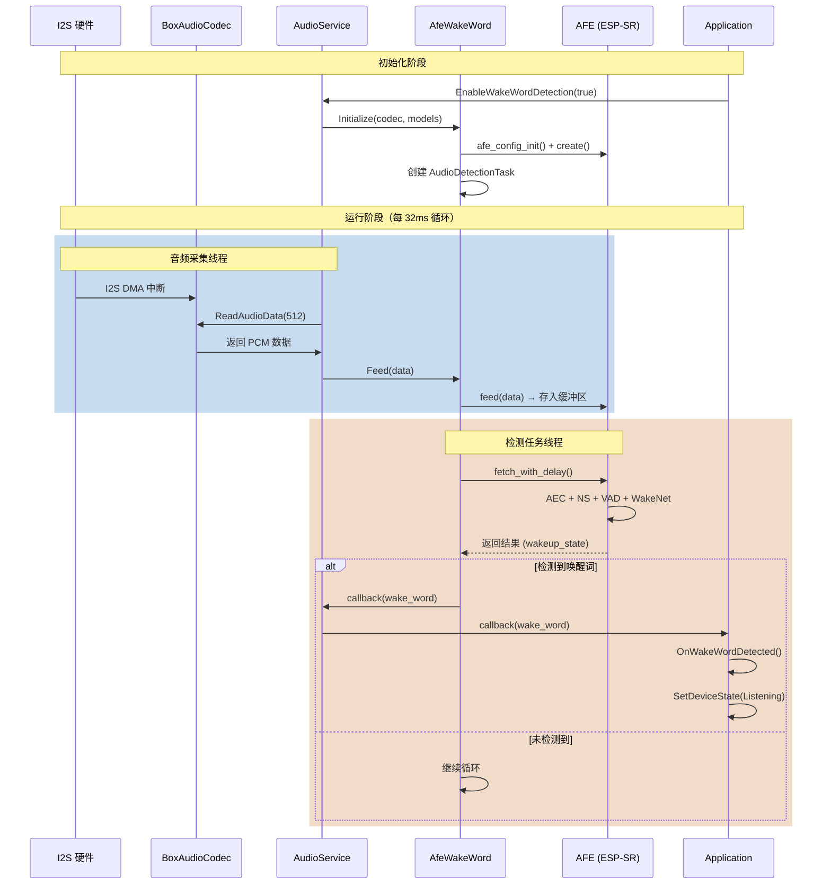

# 唤醒词检测代码定位图

## 🎯 快速导航

| 功能 | 文件路径 | 行号 | 说明 |
|-----|---------|------|------|
| **音频输入主循环** | `main/audio/audio_service.cc` | 229-242 | 从麦克风读取音频并送入检测器 |
| **Feed 音频数据** | `main/audio/wake_words/afe_wake_word.cc` | 137-162 | 将音频送入 AFE 处理 |
| **检测任务循环** | `main/audio/wake_words/afe_wake_word.cc` | 171-211 | 持续运行的检测任务 |
| **获取检测结果** | `main/audio/wake_words/afe_wake_word.cc` | 198-209 | 检测到唤醒词后的处理 |
| **回调到应用层** | `main/application.cc` | 626-673 | 应用层响应唤醒事件 |

---

## 📊 完整调用链

### 层级 1: 音频采集（硬件层）

```
文件: main/audio/codecs/box_audio_codec.cc
位置: 第 254-286 行
功能: I2S 硬件接口读取音频数据

┌─────────────────────────────────────────┐
│  BoxAudioCodec::InputData()             │  行 254
│  ↓                                      │
│  esp_codec_dev_read()                   │  行 282
│  ↓                                      │
│  [I2S DMA 缓冲区] → 16-bit PCM 数据      │
└─────────────────────────────────────────┘
```

**关键代码:**
```cpp
// main/audio/codecs/box_audio_codec.cc: 254-286
bool BoxAudioCodec::InputData(std::vector<int16_t>& data) {
    std::lock_guard<std::mutex> lock(data_if_mutex_);
    
    size_t bytes_read = 0;
    esp_err_t ret = esp_codec_dev_read(
        input_dev_, 
        data.data(), 
        data.size() * sizeof(int16_t), 
        &bytes_read, 
        portMAX_DELAY
    );
    
    return ret == ESP_OK && bytes_read > 0;
}
```

---

### 层级 2: 音频服务层（数据分发）

```
文件: main/audio/audio_service.cc
位置: 第 229-242 行（AudioInputTask 循环）
功能: 读取音频并分发到唤醒词检测器

┌─────────────────────────────────────────┐
│  AudioInputTask()                       │  行 193
│  ↓                                      │
│  [检查事件位]                            │  行 195
│  AS_EVENT_WAKE_WORD_RUNNING?            │  行 229
│  ↓ YES                                  │
│  wake_word_->GetFeedSize()             │  行 231
│  ↓                                      │
│  ReadAudioData(data, 16000, 512)       │  行 233
│  ↓                                      │
│  wake_word_->Feed(data)                │  行 234
└─────────────────────────────────────────┘
```

**关键代码 1: 音频输入主循环**
```cpp
// main/audio/audio_service.cc: 193-242
void AudioService::AudioInputTask() {
    while (true) {
        // 1. 等待事件（唤醒词检测 or 语音处理）
        EventBits_t bits = xEventGroupWaitBits(
            event_group_,
            AS_EVENT_WAKE_WORD_RUNNING | AS_EVENT_AUDIO_PROCESSOR_RUNNING,
            pdFALSE, pdFALSE, portMAX_DELAY
        );
        
        // 2. 唤醒词检测分支 ⭐ 这里是关键！
        if (bits & AS_EVENT_WAKE_WORD_RUNNING) {
            std::vector<int16_t> data;
            int samples = wake_word_->GetFeedSize();  // 通常是 512 个采样点
            
            if (samples > 0) {
                // 从 codec 读取音频数据
                if (ReadAudioData(data, 16000, samples)) {
                    // 送入唤醒词检测器 ⭐⭐⭐
                    wake_word_->Feed(data);
                    continue;
                } else {
                    ESP_LOGW(TAG, "Failed to read audio data for wake word!");
                }
            } else {
                ESP_LOGW(TAG, "Wake word feed size is 0!");
            }
        }
        
        // 3. 语音处理分支（对话模式）
        if (bits & AS_EVENT_AUDIO_PROCESSOR_RUNNING) {
            // ... 对话时的音频处理
        }
    }
}
```

**关键代码 2: 读取音频数据**
```cpp
// main/audio/audio_service.cc: 135-192
bool AudioService::ReadAudioData(std::vector<int16_t>& data, int sample_rate, int samples) {
    // 1. 确保输入已启用
    if (!codec_->input_enabled()) {
        codec_->EnableInput(true);
    }
    
    // 2. 计算需要读取的数据量（考虑采样率转换和通道数）
    int read_samples = samples * codec_->input_sample_rate() / sample_rate * codec_->input_channels();
    data.resize(read_samples);
    
    // 3. 从 codec 读取原始 PCM 数据 ⭐
    if (!codec_->InputData(data)) {
        return false;
    }
    
    // 4. 如果是双通道（麦克风 + 参考），分离通道
    if (codec_->input_channels() == 2) {
        auto mic_channel = std::vector<int16_t>(data.size() / 2);
        auto reference_channel = std::vector<int16_t>(data.size() / 2);
        
        for (size_t i = 0, j = 0; i < mic_channel.size(); ++i, j += 2) {
            mic_channel[i] = data[j];          // 通道 0: 麦克风
            reference_channel[i] = data[j + 1]; // 通道 1: 参考（用于 AEC）
        }
        
        // 5. 重采样到目标采样率
        if (codec_->input_sample_rate() != sample_rate) {
            input_resampler_.Process(mic_channel, samples);
            reference_resampler_.Process(reference_channel, samples);
        }
        
        // 6. 合并回交错格式 [M, R, M, R, ...]
        for (size_t i = 0, j = 0; i < samples; ++i, j += 2) {
            data[j] = mic_channel[i];
            data[j + 1] = reference_channel[i];
        }
        data.resize(samples * 2);
    } else {
        // 单通道: 直接重采样
        if (codec_->input_sample_rate() != sample_rate) {
            input_resampler_.Process(data, samples);
        }
        data.resize(samples);
    }
    
    return true;
}
```

---

### 层级 3: 唤醒词检测器（算法层）

```
文件: main/audio/wake_words/afe_wake_word.cc
位置: 第 137-162 行（Feed）+ 第 171-211 行（检测任务）
功能: 将音频送入 AFE 并进行检测

┌─────────────────────────────────────────┐
│  [AudioService] → Feed(data)            │  行 137
│  ↓                                      │
│  afe_iface_->feed(afe_data_, data)     │  行 161
│  ↓                                      │
│  [AFE 内部缓冲区]                        │
│                                         │
│  ┌───────────────────────────┐          │
│  │ AudioDetectionTask()      │  行 171 │
│  │ (独立任务，持续运行)        │          │
│  └───────────────────────────┘          │
│  ↓                                      │
│  afe_iface_->fetch_with_delay()        │  行 181
│  ↓                                      │
│  [检查 wakeup_state]                    │  行 198
│  ↓                                      │
│  WAKENET_DETECTED? → 触发回调           │  行 204
└─────────────────────────────────────────┘
```

**关键代码 1: 送入音频数据**
```cpp
// main/audio/wake_words/afe_wake_word.cc: 137-162
void AfeWakeWord::Feed(const std::vector<int16_t>& data) {
    if (afe_data_ == nullptr) {
        return;
    }
    
    // 【调试功能】计算音频能量，检测麦克风是否工作
    static int feed_count = 0;
    if (++feed_count % 100 == 0) {
        int64_t sum = 0;
        int max_val = 0;
        for (const auto& sample : data) {
            sum += abs(sample);
            if (abs(sample) > max_val) {
                max_val = abs(sample);
            }
        }
        int avg = data.empty() ? 0 : sum / data.size();
        ESP_LOGI(TAG, "Audio level check (feed %d): avg=%d, max=%d, samples=%d", 
                 feed_count, avg, max_val, data.size());
        if (max_val < 100) {
            ESP_LOGW(TAG, "  ⚠️ Audio level is very low! Microphone may not be working properly!");
        }
    }
    
    // ⭐⭐⭐ 关键调用：将音频送入 AFE（Audio Front-End）
    // AFE 会在内部缓冲区中进行：
    // 1. AEC（回声消除）
    // 2. NS（降噪）
    // 3. VAD（语音活动检测）
    // 4. WakeNet（神经网络推理）
    afe_iface_->feed(afe_data_, data.data());
}
```

**关键代码 2: 检测任务循环（核心！）**
```cpp
// main/audio/wake_words/afe_wake_word.cc: 171-211
void AfeWakeWord::AudioDetectionTask() {
    auto fetch_size = afe_iface_->get_fetch_chunksize(afe_data_);  // 512
    auto feed_size = afe_iface_->get_feed_chunksize(afe_data_);    // 512
    
    ESP_LOGI(TAG, "Audio detection task started, feed size: %d fetch size: %d",
        feed_size, fetch_size);
    
    int loop_count = 0;
    
    // ⭐ 持续运行的检测循环
    while (true) {
        // 1. 等待检测启用（Start() 会设置这个事件位）
        xEventGroupWaitBits(event_group_, DETECTION_RUNNING_EVENT, 
                           pdFALSE, pdTRUE, portMAX_DELAY);
        
        // 2. ⭐⭐⭐ 从 AFE 获取处理结果（阻塞调用，每 32ms 返回一次）
        //    AFE 内部会：
        //    - 从缓冲区取出 512 个采样点
        //    - 进行 AEC、NS、VAD 处理
        //    - 运行 WakeNet 神经网络推理
        //    - 返回检测结果
        auto res = afe_iface_->fetch_with_delay(afe_data_, portMAX_DELAY);
        
        if (res == nullptr || res->ret_value == ESP_FAIL) {
            ESP_LOGW(TAG, "AFE fetch failed");
            continue;
        }
        
        // 3. 打印运行状态（调试用）
        loop_count++;
        if (loop_count % 100 == 0) {
            ESP_LOGI(TAG, "Wake word detection running... (loop %d, wakeup_state=%d)", 
                     loop_count, res->wakeup_state);
        }
        
        // 4. 存储唤醒词音频数据（可选，用于发送给服务器）
        StoreWakeWordData(res->data, res->data_size / sizeof(int16_t));
        
        // 5. ⭐⭐⭐ 检查唤醒状态（这是检测结果！）
        if (res->wakeup_state == WAKENET_DETECTED) {
            ESP_LOGI(TAG, "*** WAKE WORD DETECTED! *** model_index=%d", 
                     res->wakenet_model_index);
            
            // 6. 停止检测
            Stop();
            
            // 7. 获取唤醒词名称
            last_detected_wake_word_ = wake_words_[res->wakenet_model_index - 1];
            ESP_LOGI(TAG, "Wake word name: %s", last_detected_wake_word_.c_str());
            
            // 8. ⭐⭐⭐ 触发回调，通知应用层
            if (wake_word_detected_callback_) {
                wake_word_detected_callback_(last_detected_wake_word_);
            } else {
                ESP_LOGW(TAG, "Wake word detected but callback is NULL!");
            }
        }
    }
}
```

**AFE 返回结构体定义（ESP-SR 库）:**
```cpp
// ESP-SR 库中的定义（参考）
typedef struct {
    esp_err_t ret_value;        // 操作结果
    int16_t* data;              // 处理后的音频数据
    int data_size;              // 数据大小（字节）
    afe_vad_state_t vad_state;  // VAD 状态
    afe_wakeup_state_t wakeup_state;  // ⭐ 唤醒状态
    int wakenet_model_index;    // 检测到的模型索引
} afe_fetch_result_t;

// 唤醒状态枚举
typedef enum {
    WAKENET_NO_DETECT = 0,      // 未检测到
    WAKENET_CHANNEL_VERIFIED,   // 通道验证通过
    WAKENET_DETECTED,           // ⭐ 检测到唤醒词！
    WAKENET_CHANNEL_LOST        // 丢失通道
} afe_wakeup_state_t;
```

---

### 层级 4: 回调传递（事件通知）

```
文件: main/audio/audio_service.cc + main/application.cc
位置: 第 696-703 行（设置回调）+ 第 626-673 行（处理回调）
功能: 将检测事件传递到应用层

┌─────────────────────────────────────────┐
│  [AfeWakeWord 检测任务]                  │
│  wake_word_detected_callback_(...)      │  afe_wake_word.cc:204
│  ↓                                      │
│  [AudioService Lambda]                  │
│  callbacks_.on_wake_word_detected(...)  │  audio_service.cc:700
│  ↓                                      │
│  [Application Lambda]                   │
│  xEventGroupSetBits(WAKE_WORD_DETECTED) │  application.cc:379
│  ↓                                      │
│  [Application::OnWakeWordDetected()]    │  application.cc:626
│  ↓                                      │
│  SetDeviceState(kDeviceStateConnecting) │  application.cc:641
└─────────────────────────────────────────┘
```

**关键代码 1: AudioService 设置回调**
```cpp
// main/audio/audio_service.cc: 696-703
void AudioService::SetModelsList(srmodel_list_t* models_list) {
    // ... 创建 wake_word_ 对象 ...
    
    if (wake_word_) {
        ESP_LOGI(TAG, "Wake word object created successfully");
        
        // ⭐ 设置回调：当检测到唤醒词时调用
        wake_word_->OnWakeWordDetected([this](const std::string& wake_word) {
            // 传递给上层（Application）
            if (callbacks_.on_wake_word_detected) {
                callbacks_.on_wake_word_detected(wake_word);
            }
        });
    }
}
```

**关键代码 2: Application 设置回调**
```cpp
// main/application.cc: 378-381
void Application::Start() {
    // ... 初始化 ...
    
    AudioServiceCallbacks callbacks;
    
    // ⭐ 设置唤醒词检测回调
    callbacks.on_wake_word_detected = [this](const std::string& wake_word) {
        // 设置事件位，通知主任务
        xEventGroupSetBits(event_group_, MAIN_EVENT_WAKE_WORD_DETECTED);
    };
    
    audio_service_.Start(callbacks);
    
    // ... 主任务循环会等待这个事件位 ...
}
```

**关键代码 3: Application 处理唤醒事件**
```cpp
// main/application.cc: 626-673
void Application::OnWakeWordDetected() {
    ESP_LOGI(TAG, "OnWakeWordDetected() called, device_state=%d, protocol=%p", 
             device_state_, protocol_.get());
    
    if (!protocol_) {
        ESP_LOGW(TAG, "Protocol not initialized, ignoring wake word");
        return;
    }
    
    // 只在待机状态响应唤醒
    if (device_state_ == kDeviceStateIdle) {
        ESP_LOGI(TAG, "Device in IDLE state, processing wake word...");
        
        // 1. 编码唤醒词音频数据
        audio_service_.EncodeWakeWord();
        
        // 2. 打开音频通道（连接服务器）
        if (!protocol_->IsAudioChannelOpened()) {
            ESP_LOGI(TAG, "Opening audio channel...");
            SetDeviceState(kDeviceStateConnecting);
            
            if (!protocol_->OpenAudioChannel()) {
                ESP_LOGE(TAG, "Failed to open audio channel");
                // 失败：重新启用唤醒检测
                audio_service_.EnableWakeWordDetection(true);
                return;
            }
        }
        
        // 3. 获取唤醒词名称
        auto wake_word = audio_service_.GetLastWakeWord();
        ESP_LOGI(TAG, "*** Wake word detected: %s ***", wake_word.c_str());
        
#if CONFIG_SEND_WAKE_WORD_DATA
        // 4. 发送唤醒词音频数据到服务器
        while (auto packet = audio_service_.PopWakeWordPacket()) {
            protocol_->SendAudio(std::move(packet));
        }
#endif
        
        // 5. 设置设备状态为"监听中"
        SetDeviceState(kDeviceStateListening);
        
        // 6. 启用语音处理（开始对话）
        audio_service_.EnableVoiceProcessing(true);
        
        // 7. 更新显示
        auto display = Board::GetInstance().GetDisplay();
        display->SetChatMessage("system", "");
        display->SetEmotion("microphone");
    }
}
```

---

## 🔍 关键数据结构

### 1. 音频数据格式

```cpp
// PCM 音频数据
std::vector<int16_t> data;
// - 16-bit 有符号整数
// - 采样率: 16000 Hz (通常)
// - 帧大小: 512 samples = 32ms @ 16kHz
// - 通道: 1 或 2（M 或 MR）
//   - M: 单通道（仅麦克风）
//   - MR: 双通道（麦克风 + 参考）
```

### 2. AFE 配置结构

```cpp
// main/audio/wake_words/afe_wake_word.cc: 85-96
afe_config_t* afe_config = afe_config_init(
    "MR",           // 输入格式: M=麦克风, R=参考
    models_,        // 模型列表
    AFE_TYPE_SR,    // 类型: 语音识别
    AFE_MODE_HIGH_PERF  // 模式: 高性能
);

afe_config->aec_init = true;                          // 启用 AEC
afe_config->aec_mode = AEC_MODE_SR_HIGH_PERF;        // AEC 模式
afe_config->afe_perferred_core = 1;                  // 运行在核心 1
afe_config->memory_alloc_mode = AFE_MEMORY_ALLOC_MORE_PSRAM;  // 使用 PSRAM
```

### 3. 回调函数链

```cpp
// 回调链: AfeWakeWord → AudioService → Application

// 1. AfeWakeWord 存储回调
std::function<void(const std::string& wake_word)> wake_word_detected_callback_;

// 2. AudioService 回调结构
struct AudioServiceCallbacks {
    std::function<void(const std::string&)> on_wake_word_detected;
    std::function<void(bool)> on_vad_change;
    // ...
};

// 3. Application Lambda 捕获
callbacks.on_wake_word_detected = [this](const std::string& wake_word) {
    xEventGroupSetBits(event_group_, MAIN_EVENT_WAKE_WORD_DETECTED);
};
```

---

## ⏱️ 时序图



---

## 🎯 你需要关注的关键位置

### 1. 语音输入模型的接口

| 位置 | 说明 |
|-----|------|
| **`main/audio/audio_service.cc:233`** | `ReadAudioData()` - 从 codec 读取音频 |
| **`main/audio/wake_words/afe_wake_word.cc:161`** | `afe_iface_->feed()` - 送入 AFE 处理 |
| **`main/audio/codecs/box_audio_codec.cc:282`** | `esp_codec_dev_read()` - I2S 硬件读取 |

### 2. 获取检测结果的位置

| 位置 | 说明 |
|-----|------|
| **`main/audio/wake_words/afe_wake_word.cc:181`** | `afe_iface_->fetch_with_delay()` - 获取 AFE 处理结果 |
| **`main/audio/wake_words/afe_wake_word.cc:198-209`** | 检查 `wakeup_state == WAKENET_DETECTED` |
| **`main/audio/wake_words/afe_wake_word.cc:204`** | 触发回调 `wake_word_detected_callback_()` |

### 3. 核心算法调用

```cpp
// ⭐⭐⭐ 最核心的两个函数调用：

// 1. 送入音频（每 32ms 调用一次）
afe_iface_->feed(afe_data_, audio_data);
// 位置: main/audio/wake_words/afe_wake_word.cc:161

// 2. 获取检测结果（阻塞调用，每 32ms 返回）
auto res = afe_iface_->fetch_with_delay(afe_data_, portMAX_DELAY);
// 位置: main/audio/wake_words/afe_wake_word.cc:181
// 返回: res->wakeup_state (WAKENET_DETECTED = 检测到)
```

---

## 🐛 调试技巧

### 1. 检查音频数据是否正常

在 `AfeWakeWord::Feed()` 中已经添加了音频电平检测：
```cpp
// main/audio/wake_words/afe_wake_word.cc: 143-159
// 每 100 帧打印一次音频电平
ESP_LOGI(TAG, "Audio level check (feed %d): avg=%d, max=%d", 
         feed_count, avg, max_val);
```

**正常值:**
- `avg` 应该 > 50（有语音时）
- `max` 应该 > 1000（大声说话时）

**异常:** 如果 `avg=0, max=0` → 麦克风未工作！

### 2. 检查检测任务是否运行

```cpp
// main/audio/wake_words/afe_wake_word.cc: 189-193
// 每 100 次循环打印一次
ESP_LOGI(TAG, "Wake word detection running... (loop %d, wakeup_state=%d)", 
         loop_count, res->wakeup_state);
```

**正常:** 应该每 3.2 秒打印一次（100 * 32ms）

### 3. 检查 AFE 配置

```cpp
// main/audio/wake_words/afe_wake_word.cc: 82-96
ESP_LOGI(TAG, "Input format: %s, channels=%d, ref_num=%d", 
         input_format.c_str(), codec_->input_channels(), ref_num);
ESP_LOGI(TAG, "AFE config: aec_init=%d, aec_mode=%d", 
         afe_config->aec_init, afe_config->aec_mode);
```

**Korvo-2 V3 期望值:**
- `Input format: MR` (麦克风 + 参考)
- `channels: 2`
- `ref_num: 1`
- `aec_init: 1`

### 4. 添加自定义日志

如果需要更详细的调试，可以在这些位置添加日志：

```cpp
// 1. 每次 Feed 都打印（会非常多，仅测试用）
void AfeWakeWord::Feed(const std::vector<int16_t>& data) {
    ESP_LOGV(TAG, "Feed: %d samples", data.size());  // LOGV = Verbose
    afe_iface_->feed(afe_data_, data.data());
}

// 2. 打印 AFE 返回的详细信息
auto res = afe_iface_->fetch_with_delay(afe_data_, portMAX_DELAY);
ESP_LOGD(TAG, "AFE result: ret=%d, vad=%d, wakeup=%d", 
         res->ret_value, res->vad_state, res->wakeup_state);

// 3. 打印 WakeNet 内部分数（需要修改 ESP-SR 库）
// 这需要访问 ESP-SR 库的内部 API
```

---

## 📝 总结

### 数据流
```
麦克风 → I2S DMA → Codec::InputData() → AudioService::ReadAudioData() 
    → AfeWakeWord::Feed() → afe_iface_->feed() → [AFE 缓冲区]
```

### 检测流
```
[AFE 缓冲区] → afe_iface_->fetch_with_delay() → AEC + NS + VAD + WakeNet 
    → res->wakeup_state → 回调 → Application::OnWakeWordDetected()
```

### 关键文件（按重要性）
1. **`main/audio/wake_words/afe_wake_word.cc`** - 核心检测逻辑
2. **`main/audio/audio_service.cc`** - 音频数据分发
3. **`main/audio/codecs/box_audio_codec.cc`** - 硬件接口
4. **`main/application.cc`** - 应用层响应

---

**文档版本:** v1.0  
**创建日期:** 2025-10-10  
**作者:** AI Assistant  

