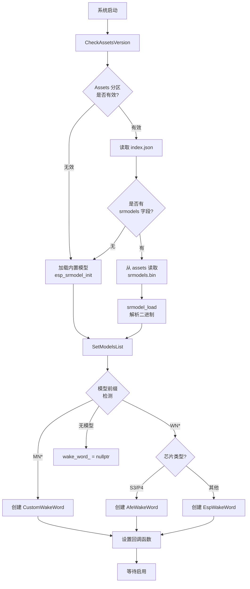

# 唤醒词模型加载原理深度分析

## 📚 目录
1. [模型类型与架构](#模型类型与架构)
2. [模型存储与加载流程](#模型存储与加载流程)
3. [模型初始化原理](#模型初始化原理)
4. [唤醒词检测流程](#唤醒词检测流程)
5. [内存管理](#内存管理)
6. [性能优化](#性能优化)

---

## 🎯 模型类型与架构

### 支持的模型类型

小智项目支持两类唤醒模型：

| 模型类型 | 前缀标识 | 用途 | 适用芯片 |
|---------|---------|------|---------|
| **WakeNet** | `wn*` | 唤醒词检测 | 所有 ESP32 系列 |
| **MultiNet** | `mn*` | 自定义命令词识别 | ESP32-S3/P4 + PSRAM |

### 三种唤醒词实现

```cpp
// 1. EspWakeWord - 基础 WakeNet（ESP32, ESP32-C3/C5/C6）
#if !CONFIG_IDF_TARGET_ESP32S3 && !CONFIG_IDF_TARGET_ESP32P4
    wake_word_ = std::make_unique<EspWakeWord>();
#endif

// 2. AfeWakeWord - WakeNet + AFE（ESP32-S3/P4 + PSRAM）
#if CONFIG_IDF_TARGET_ESP32S3 || CONFIG_IDF_TARGET_ESP32P4
    if (有 WN 前缀模型) {
        wake_word_ = std::make_unique<AfeWakeWord>();  // 支持 AEC 回声消除
    }
#endif

// 3. CustomWakeWord - MultiNet 自定义命令词（ESP32-S3/P4 + PSRAM）
#if CONFIG_IDF_TARGET_ESP32S3 || CONFIG_IDF_TARGET_ESP32P4
    if (有 MN 前缀模型) {
        wake_word_ = std::make_unique<CustomWakeWord>();  // 支持自定义命令
    }
#endif
```

### 架构对比

| 特性 | EspWakeWord | AfeWakeWord | CustomWakeWord |
|-----|-------------|-------------|----------------|
| 回声消除 (AEC) | ❌ | ✅ | ✅ |
| 降噪 (NS) | ❌ | ✅ | ✅ |
| 语音活动检测 (VAD) | ❌ | ✅ | ✅ |
| 自定义命令词 | ❌ | ❌ | ✅ |
| PSRAM 需求 | 否 | 是 | 是 |
| 内存占用 | 小 | 中 | 大 |

---

## 📦 模型存储与加载流程

### 1. 模型存储位置

唤醒模型可以存储在两个位置：

#### A. 内置模型（Built-in Models）
```
固件中编译进去的模型
├── 位置：ESP-IDF 组件中
├── 加载方式：esp_srmodel_init("model")
└── 优点：无需额外存储，固件即用
```

#### B. Assets 分区模型（Dynamic Models）
```
assets 分区中的自定义模型
├── 位置：assets 分区（Flash）
├── 文件：srmodels.bin
├── 加载方式：srmodel_load(binary_data)
└── 优点：可以在线更新，支持自定义唤醒词
```

### 2. 完整加载流程图



### 3. 代码实现详解

#### Step 1: Assets 加载（main/assets.cc）

```cpp
void Assets::Apply() {
    // 1. 读取 index.json
    cJSON* root = cJSON_Parse(index_json);
    
    // 2. 查找 srmodels 字段
    cJSON* srmodels = cJSON_GetObjectItem(root, "srmodels");
    
    if (cJSON_IsString(srmodels)) {
        // 3. 从 assets 分区读取模型二进制数据
        std::string srmodels_file = srmodels->valuestring;  // "srmodels.bin"
        void* ptr;
        size_t size;
        GetAssetData(srmodels_file, ptr, size);
        
        // 4. 加载模型
        models_list_ = srmodel_load(static_cast<uint8_t*>(ptr));
        
        // 5. 传递给 AudioService
        Application::GetInstance()
            .GetAudioService()
            .SetModelsList(models_list_);
    } else {
        // 没有 assets 模型，使用内置模型
        models_list_ = esp_srmodel_init("model");
        Application::GetInstance()
            .GetAudioService()
            .SetModelsList(models_list_);
    }
}
```

#### Step 2: 模型类型识别（main/audio/audio_service.cc）

```cpp
void AudioService::SetModelsList(srmodel_list_t* models_list) {
    models_list_ = models_list;
    
    // 打印模型信息
    ESP_LOGI(TAG, "Models list count: %d", models_list_->num);
    for (int i = 0; i < models_list_->num; i++) {
        ESP_LOGI(TAG, "  Model %d: %s", i, models_list_->model_name[i]);
    }
    
    // 根据模型前缀选择实现类
#if CONFIG_IDF_TARGET_ESP32S3 || CONFIG_IDF_TARGET_ESP32P4
    // ESP32-S3/P4: 支持 MN 和 WN
    if (esp_srmodel_filter(models_list_, ESP_MN_PREFIX, NULL) != nullptr) {
        // 找到 MultiNet 模型 -> 自定义命令词
        wake_word_ = std::make_unique<CustomWakeWord>();
    } 
    else if (esp_srmodel_filter(models_list_, ESP_WN_PREFIX, NULL) != nullptr) {
        // 找到 WakeNet 模型 -> AFE 唤醒
        wake_word_ = std::make_unique<AfeWakeWord>();
    }
#else
    // 其他芯片: 只支持 WN
    if (esp_srmodel_filter(models_list_, ESP_WN_PREFIX, NULL) != nullptr) {
        wake_word_ = std::make_unique<EspWakeWord>();
    }
#endif
    
    // 设置检测回调
    if (wake_word_) {
        wake_word_->OnWakeWordDetected([this](const std::string& wake_word) {
            if (callbacks_.on_wake_word_detected) {
                callbacks_.on_wake_word_detected(wake_word);
            }
        });
    }
}
```

---

## 🔧 模型初始化原理

### 1. AfeWakeWord 初始化（最常用）

```cpp
bool AfeWakeWord::Initialize(AudioCodec* codec, srmodel_list_t* models_list) {
    // 1. 确定参考通道数（用于 AEC）
    int ref_num = codec_->input_reference() ? 1 : 0;
    
    // 2. 获取或初始化模型列表
    if (models_list == nullptr) {
        models_ = esp_srmodel_init("model");  // 加载内置模型
    } else {
        models_ = models_list;  // 使用传入的模型
    }
    
    // 3. 遍历模型，找到 WakeNet 模型
    for (int i = 0; i < models_->num; i++) {
        if (strstr(models_->model_name[i], ESP_WN_PREFIX) != NULL) {
            wakenet_model_ = models_->model_name[i];  // 例如: "wn9_nihaoxiaozhi_tts"
            
            // 4. 获取唤醒词列表
            auto words = esp_srmodel_get_wake_words(models_, wakenet_model_);
            // words = "你好小智;嗨小智"（多个唤醒词用分号分隔）
            
            // 5. 解析唤醒词
            std::stringstream ss(words);
            std::string word;
            while (std::getline(ss, word, ';')) {
                wake_words_.push_back(word);  // 存储每个唤醒词
            }
        }
    }
    
    // 6. 构建音频输入格式字符串
    std::string input_format;
    // M = Microphone（麦克风）
    // R = Reference（参考通道，用于 AEC）
    for (int i = 0; i < codec_->input_channels() - ref_num; i++) {
        input_format.push_back('M');  // 添加麦克风通道
    }
    for (int i = 0; i < ref_num; i++) {
        input_format.push_back('R');  // 添加参考通道
    }
    // 例如：Korvo-2 V3 = "MR" (1个麦克风 + 1个参考)
    
    // 7. 初始化 AFE 配置
    afe_config_t* afe_config = afe_config_init(
        input_format.c_str(),  // "MR"
        models_,               // 模型列表
        AFE_TYPE_SR,          // 语音识别类型
        AFE_MODE_HIGH_PERF    // 高性能模式
    );
    
    // 8. 配置 AEC 参数
    afe_config->aec_init = codec_->input_reference();  // 是否启用 AEC
    afe_config->aec_mode = AEC_MODE_SR_HIGH_PERF;     // AEC 模式
    afe_config->afe_perferred_core = 1;               // 运行在核心 1
    afe_config->afe_perferred_priority = 1;           // 优先级
    afe_config->memory_alloc_mode = AFE_MEMORY_ALLOC_MORE_PSRAM;  // 使用 PSRAM
    
    // 9. 创建 AFE 接口和数据结构
    afe_iface_ = esp_afe_handle_from_config(afe_config);
    afe_data_ = afe_iface_->create_from_config(afe_config);
    
    // 10. 创建检测任务
    xTaskCreate([](void* arg) {
        auto this_ = (AfeWakeWord*)arg;
        this_->AudioDetectionTask();  // 持续运行的检测任务
        vTaskDelete(NULL);
    }, "audio_detection", 4096, this, 3, nullptr);
    
    return true;
}
```

### 2. 模型数据结构

```cpp
// ESP-SR 库提供的结构（来自 ESP-IDF）
typedef struct {
    int num;                  // 模型数量
    char **model_name;        // 模型名称数组
    void *model_data;         // 模型二进制数据
} srmodel_list_t;

// 示例：
// num = 1
// model_name[0] = "wn9_nihaoxiaozhi_tts"
// model_data = [二进制神经网络权重数据]
```

### 3. 模型命名规则

```
格式: <type><version>_<name>_<variant>

示例:
- wn9_nihaoxiaozhi_tts
  └─ wn: WakeNet 唤醒网络
  └─ 9: 版本 9
  └─ nihaoxiaozhi: 唤醒词拼音
  └─ tts: TTS 优化版本

- mn3_cn
  └─ mn: MultiNet 多命令网络
  └─ 3: 版本 3
  └─ cn: 中文
```

---

## 🎙️ 唤醒词检测流程

### 1. 音频数据流

```
麦克风 → AudioCodec → AudioService → AfeWakeWord → 检测
  ↓         ↓            ↓              ↓
16bit    I2S DMA    AudioInputTask   Feed()
PCM      Buffer     (512 samples)    
```

### 2. AudioDetectionTask 循环

```cpp
void AfeWakeWord::AudioDetectionTask() {
    auto feed_size = afe_iface_->get_feed_chunksize(afe_data_);  // 512
    auto fetch_size = afe_iface_->get_fetch_chunksize(afe_data_); // 512
    
    int loop_count = 0;
    while (true) {
        // 1. 等待唤醒检测启用
        xEventGroupWaitBits(event_group_, DETECTION_RUNNING_EVENT, ...);
        
        // 2. 从 AFE 获取处理后的音频帧
        //    AFE 内部会进行：
        //    - AEC（回声消除）
        //    - NS（降噪）
        //    - VAD（语音活动检测）
        //    - WakeNet 神经网络推理
        auto res = afe_iface_->fetch_with_delay(afe_data_, portMAX_DELAY);
        
        if (res == nullptr || res->ret_value == ESP_FAIL) {
            continue;
        }
        
        // 3. 检查唤醒状态
        if (res->wakeup_state == WAKENET_DETECTED) {
            // 唤醒词检测到！
            Stop();  // 停止检测
            
            // 4. 获取唤醒词名称
            last_detected_wake_word_ = wake_words_[res->wakenet_model_index - 1];
            
            // 5. 调用回调通知应用层
            if (wake_word_detected_callback_) {
                wake_word_detected_callback_(last_detected_wake_word_);
            }
        }
        
        // 6. 定期打印运行状态（调试）
        loop_count++;
        if (loop_count % 100 == 0) {
            ESP_LOGI(TAG, "Wake word detection running... (loop %d)", loop_count);
        }
    }
}
```

### 3. AFE 内部处理流程

```
输入音频 (MR 双通道)
    ↓
┌────────────────────────┐
│  1. AEC (回声消除)      │  ← 使用参考通道 (R)
│     消除扬声器输出      │
└────────────────────────┘
    ↓
┌────────────────────────┐
│  2. NS (降噪)          │
│     减少背景噪音        │
└────────────────────────┘
    ↓
┌────────────────────────┐
│  3. VAD (活动检测)      │
│     检测是否有语音      │
└────────────────────────┘
    ↓
┌────────────────────────┐
│  4. WakeNet (神经网络)  │  ← 核心检测算法
│     - 特征提取          │
│     - CNN/RNN 推理     │
│     - 相似度计算        │
└────────────────────────┘
    ↓
检测结果 (WAKENET_DETECTED)
```

### 4. WakeNet 神经网络

WakeNet 是一个轻量级的关键词检测神经网络：

```
架构特点:
├── 输入: 音频 MFCC 特征（梅尔频率倒谱系数）
├── 隐藏层: 
│   ├── CNN（卷积神经网络）- 提取时频特征
│   └── RNN/LSTM（循环神经网络）- 建模时序关系
├── 输出: 唤醒词概率分数
└── 阈值: DET_MODE_95 (95% 置信度)

参数量: ~100KB（高度优化）
推理速度: < 10ms per frame
功耗: 适合边缘设备
```

---

## 💾 内存管理

### 1. 内存分配策略

```cpp
// AFE 配置: 优先使用 PSRAM
afe_config->memory_alloc_mode = AFE_MEMORY_ALLOC_MORE_PSRAM;

内存分布:
├── SRAM (片上 RAM)
│   ├── 音频缓冲区（DMA）
│   ├── 任务栈
│   └── 少量临时变量
│
└── PSRAM (外部 RAM)
    ├── 模型权重数据
    ├── AFE 处理缓冲区
    ├── 特征提取缓冲区
    └── 历史帧缓存
```

### 2. 模型内存占用

| 模型类型 | 大小 | 存储位置 | 运行时内存 |
|---------|------|---------|-----------|
| WakeNet 9 | ~100KB | Flash/PSRAM | ~200KB |
| MultiNet 3 | ~300KB | Flash/PSRAM | ~500KB |
| AFE 缓冲区 | - | PSRAM | ~100KB |

### 3. 生命周期管理

```cpp
// 1. 创建
AudioService::SetModelsList() 
    → 创建 WakeWord 对象
    → models_list_ 指针传递（不复制）

// 2. 初始化
AudioService::EnableWakeWordDetection(true)
    → wake_word_->Initialize()
    → 模型数据映射到 AFE
    → 创建检测任务

// 3. 运行
AudioDetectionTask() 持续运行
    → afe_iface_->fetch() 每帧检测
    → 检测到后自动 Stop()

// 4. 销毁
AudioService 析构
    → wake_word_ 智能指针自动释放
    → AfeWakeWord 析构释放 AFE 资源
```

---

## ⚡ 性能优化

### 1. 多核优化

```cpp
// AFE 检测任务运行在核心 1
afe_config->afe_perferred_core = 1;

CPU 核心分工:
├── 核心 0: 
│   ├── WiFi/蓝牙协议栈
│   ├── 主应用逻辑
│   └── LVGL 图形渲染
│
└── 核心 1:
    ├── AFE 音频处理 ✓
    ├── WakeNet 推理 ✓
    └── 音频编解码
```

### 2. 实时性保证

```cpp
// 任务优先级
xTaskCreate(..., 
    "audio_detection",  // 任务名
    4096,               // 栈大小 (4KB)
    this, 
    3,                  // 优先级 3（较高）
    nullptr
);

优先级层级:
├── 7-5: 系统关键任务
├── 4-3: 音频处理任务 ✓
├── 2-1: 网络、显示
└── 0: 空闲任务
```

### 3. 量化优化

```cpp
MC Quantized wakenet9: 
    ├── 8-bit 整数量化
    ├── 推理速度提升 3-4x
    ├── 内存占用减少 4x
    └── 精度损失 < 2%
```

### 4. 检测阈值调优

```cpp
// DET_MODE_95: 95% 置信度阈值
wakenet_data_ = wakenet_iface_->create(model_name, DET_MODE_95);

阈值模式:
├── DET_MODE_90: 灵敏（误触发率高）
├── DET_MODE_95: 平衡（推荐）✓
└── DET_MODE_99: 严格（漏检率高）
```

---

## 🔍 调试技巧

### 1. 查看加载的模型

```cpp
void AudioService::SetModelsList(srmodel_list_t* models_list) {
    ESP_LOGI(TAG, "Models list count: %d", models_list_->num);
    for (int i = 0; i < models_list_->num; i++) {
        ESP_LOGI(TAG, "  Model %d: %s", i, models_list_->model_name[i]);
    }
}
```

### 2. 查看唤醒词列表

```cpp
bool AfeWakeWord::Initialize(...) {
    auto words = esp_srmodel_get_wake_words(models_, wakenet_model_);
    ESP_LOGI(TAG, "Wake words: %s", words);  // "你好小智;嗨小智"
}
```

### 3. 监控检测状态

```cpp
void AfeWakeWord::AudioDetectionTask() {
    if (loop_count % 100 == 0) {
        ESP_LOGI(TAG, "Detection running (loop %d, wakeup_state=%d)", 
                 loop_count, res->wakeup_state);
    }
}
```

---

## 📚 总结

### 核心要点

1. **两种模型来源**
   - 内置模型：固件中编译
   - Assets 模型：可在线更新

2. **三种实现方式**
   - EspWakeWord：基础版（所有芯片）
   - AfeWakeWord：增强版（S3/P4 + AEC）
   - CustomWakeWord：自定义命令（S3/P4）

3. **完整流程**
   ```
   加载模型 → 识别类型 → 创建对象 → 初始化 AFE → 启动检测任务 → 持续推理 → 触发回调
   ```

4. **性能关键**
   - PSRAM 存储模型和缓冲区
   - 双核并行处理
   - 8-bit 量化推理
   - 阈值平衡精度和灵敏度

### 扩展阅读

- ESP-SR 官方文档: https://github.com/espressif/esp-sr
- WakeNet 技术白皮书
- AFE 音频前端处理原理
- MultiNet 命令词识别

---

**文档版本:** v1.0  
**创建日期:** 2025-10-10  
**适用固件:** v2.0.3+

